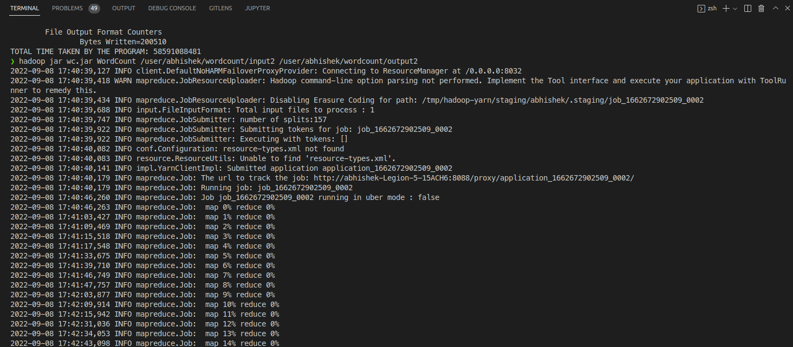
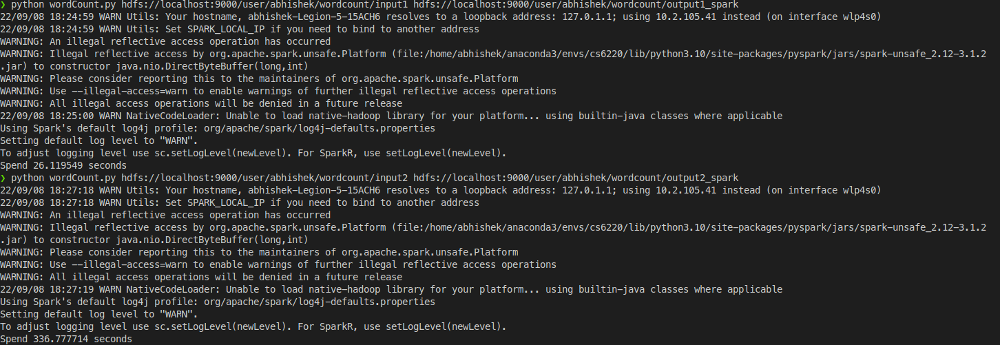
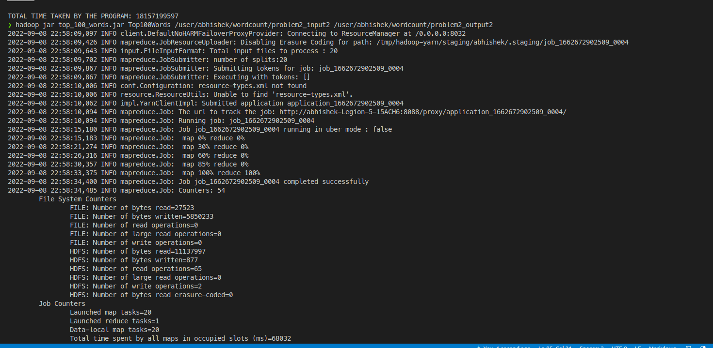
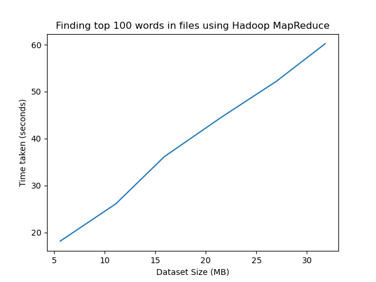

# Programming Assignment 1
## The Task - Option 1.1
- Install HDFS and Hadoop MapReduce on your laptop. 
- Run the word count map-reduce program, and report the runtime for two different sizes of datasets. 
- Using MapReduce to solve another problem. You may choose one of the following or create a problem yourself. 
  - Consider a dataset of 20 files, print the top 100 words occurring in the most files
  - Solving K-means clustering problem with a dataset given in Spark ML lib, R, Hadoop Mahout ML library, or Scikit-learn. 
You may use excel file to generate your runtime statistics plot or organize the performance measurement data in a tabular format. You are encouraged to learn by observing the runtime performance of Hadoop/Spark MapReduce program through different ways of programming the same problem and show their impact on the runtime performance of the MapReduce job.

## Installation
### Hadoop
1. Visit https://hadoop.apache.org/docs/stable/hadoop-project-dist/hadoop-common/SingleCluster.html to install the Pseudo-Distributed version for Hadoop and HDFS.
2. Add the Hadoop installation to the environment variables for easier access to the hadoop binary.
3. Test the Hadoop installation in local mode by the following grep map reduce example -
```
$ cp <hadoop_installation_dir>/etc/hadoop/*.xml test-hadoop/input
$ hadoop jar <hadoop_installation_dir>/share/hadoop/mapreduce/hadoop-mapreduce-examples-3.3.4.jar grep test-hadoop/input test-hadoop/output 'dfs[a-z.]+'
$ cat test-hadoop/output/*
```
### Python
1. Install `pyspark` using `pip install pyspark`.

## Problem 1 - Word Count 
With this problem, I wanted to do two-fold comparison - Comparing the implementation technique and comparing the performance depending on the dataset size. In order to do this, I decided that my two implementation techniques would be Hadoop MapReduce and Spark MapReduce, while running them on 2 datasets of different sizes.
### Dataset
I took the top 27 books from [Project Gutenberg Top 100 Ebooks](https://www.gutenberg.org/browse/scores/top), and divided them into 2 datasets.
- **Dataset 1** - I took the top 2 ebooks and replicated them 1300 times to create a single file dataset of 1.01 GB. My main motivation with this was to create a dataset that can fit in the memory.
- **Dataset 2** - I took the top 27 ebooks and replicated them 1600 times to create a single file dataset of 19.6 GB. My main intention with this dataset was to create a dataset that cannot be loaded into the memory in one swoop.
- The dataset is located on the following link located on my GT OneDrive Account - https://gtvault-my.sharepoint.com/:f:/g/personal/asharma756_gatech_edu/ElL9e6W84hFNslJo3Bz0ugkBfbPfRj4miC3D5hGc0klPAg?e=7FFIPw

### Hadoop Map-Reduce Program
(Following the tutorial at https://hadoop.apache.org/docs/stable/hadoop-mapreduce-client/hadoop-mapreduce-client-core/MapReduceTutorial.html)

1. Write the code in [the Java file](WordCount_Hadoop/WordCount.java).
   - The source code consists of 2 sub-classes of the main class `WordCount` - a Mapper (`TokenizerMapper`) and a Reducer (`IntSumReducer`).
   - The Mapper simply writes a pair of word and count 1 tot he reducer.
   - The Reducer takes those count and aggregates them from a specific word.
2. Compile the code to create the .jar file for execution by the following commands -
```
$> hadoop com.sun.tools.javac.Main WordCount.java
$> jar cf wc.jar WordCount*.class
```
3. Execute the word count program. All the execution is mentioned in the [execution command file](Hadoop_WordCount_results/Hadoop_WC_execution_commands.md).
4. All the executions and YARN server dashboard results are in [Hadoop_WordCount_results](Hadoop_WordCount_results) folder and the wordcount results/outputs are located at the following [OneDrive location](https://gtvault-my.sharepoint.com/:f:/g/personal/asharma756_gatech_edu/Eq0KmSxhGxpJkOW_iOd8OgEBX7CWJJQo4Yd8YaRaZ7GnuA?e=3aqeRD)



### Spark Map-Reduce Program
(Adapted from https://gist.github.com/qcl/dfa0fd979c18738539c8)

1. Write the code in [the Python file](WordCount_Spark/wordCount.py).
   - The source code simply consists of a map function and a reduce function coded in a functional paradigm.
2. Execute the word count program. All the execution commands is mentioned in the [execution command file](Spark_WordCount_results/Spark_WC_execution_commands.md).
3. All the executions are in [Spark_WordCount_results](Spark_WordCount_results) folder and the wordcount results/outputs are located at the following [OneDrive location](https://gtvault-my.sharepoint.com/:f:/g/personal/asharma756_gatech_edu/EtOCJEjlxcRCnLJidnKafUkBB5iMEsnyJ_l3kF06ZySSxg?e=iobj40).



### Word Count Performance Results
| Dataset Size | Hadoop (Java) | Spark (Python) |
| --- | --- | --- |
| **1.01 GB** | 58.59 sec | 26.11 sec |
| **19.6 GB** | 891.4 sec | 336.77 sec |

### Analysis 
**Hadoop MapReduce v/s Spark MapReduce**
- As you can see Spark outperforms Hadoop MapReduce (MR) on both the datasets with quite a significant performance gap. Spark uses RAM as the cache to store the data and then perform compute on both. Hadoop MR, on the other hand, uses the disk to perform all its compute operations. Since RAM accesses is very fast compared to disk accesses, it is no surprise that Spark has outperformed Hadoop MR.
- There is one surprising find for me though - I half expected that the 19.6 GB dataset would be much taxing for the Spark, and the performance of Hadoop MR and Spark would be comparable (even if Spark would win out at the end). This thought arised because 19.6 GB is greater than my RAM capacity (16.0 GB). So, I thought it would be difficult for Spark to compute since it would have to bring memory from disk to RAM, and memory transfers from disks are always slow. But what might have happened in the end is that the dataset was not that quite large enough for my RAM. Even having a 16 GB RAM and a 19.6 GB dataset, the program would have to do only one memory swap between the disk and the RAM - which might not hurt the performance as much. Unfortunately, I couldn't afford to get a larger dataset, as I did not have enough memory to store the dataset, nor did I have a distributed setup to store the dataset across systems for the computation to perform. 
**Small Dataset v/s Big Dataset**
- In both types of implementations, we have seen that the execution time increases with the increase in dataset size.
- This can also be analyzed and verified from the implementation technique of the word-count program. The mappers simply go over each word and then emit the resulting mapper pair for each word. So, as the number of words increase in the dataset, the more number of iterations happen for the mappers. This means the mappers follow an `O(n)` time complexity algorithm, where `n` is the number of words in the dataset. Hence, it can be easily seen that the execution time scales linearly with dataset size.
**General Notes**
- With this analysis, it is easy to compare the runtime performance optimizations of the Hadoop MR and Spark approach on varied dataset sizes.

## Problem 2 - Top 100 Words occurring in the most files

### Dataset
I took the top 30 ebooks from [Project Gutenberg](https://www.gutenberg.org/browse/scores/top), and divided them into 3 datsets in the following way -
1. Top 10 eBooks (5.6 MB)
2. Top 20 eBooks (11.1 MB)
3. Top 30 eBooks (15.9 MB)
4. Top 30 eBooks + Top 10 eBooks (Duplicated) (21.5 MB)
5. Top 30 eBooks + Top 20 eBooks (Duplicated) (27.0 MB)
6. Top 30 eBooks (Duplicated 2 times) (31.8 MB)
All the books are located here in my Georgia Tech OneDrive - https://gtvault-my.sharepoint.com/:f:/g/personal/asharma756_gatech_edu/EiXWSQTJJQVBnR7puEv0lTsBBHBlZy8kHWBne_V8ep7Xtg?e=t1RhsP

### Top 100 Words Program
(Adapted using idea mentioned in the following article - https://www.geeksforgeeks.org/how-to-find-top-n-records-using-mapreduce/)

My approach for the problem - 
1. For the mapper process, we use a hash map to track the number of occurrences of each word.
   - At the end of going through the input split, the mapper choses the top 100 occurences, and then writes them to the reducer class.
2. For the reducer process, we take the mapper context from all the mappers, and group them to one hash map and then trim them to the top 100 occurrences - which would be the result.
3. The program is located here - [Top100Words.java](Top100Words/Top100Words.java).
4. Compile the program -
```
$> hadoop com.sun.tools.javac.Main Top100Words.java
$> jar cf top_100_words.jar Top100Words*.class
```
5. Execute the program by the commands listed in the [markdown file](Top100Words_result/Top100Words_execution_commands.md).
6. All the executions are located in the [Top10Words_result](Top100Words_result) folder and all the outputs are located at my [Georgia Tech OneDrive folder](https://gtvault-my.sharepoint.com/:f:/g/personal/asharma756_gatech_edu/EiIsIIuO4wBBmVMkFe4lymoBtootssH6vhhd7AWwIBihdA?e=R5XhGV)



### Top 100 Words Program Performance Results
| Dataset Size | Hadoop (Java) |
| --- | --- |
| **5.6 MB** | 18.15 sec |
| **11.1 MB** | 26.1 sec |
| **15.9 MB** | 36.16 sec |
| **21.5 MB** | 44.49 sec | 
| **27.0 MB** | 52.24 sec |
| **31.8 MB** | 60.21 sec |



### Analysis
- As I had hypothesised, the performance of the Hadoop MR increases linearly as the dataset size increases for a Map Reduce operation, when the dataset size is not as large as the RAM size. This experiment helped me confirm the learnings that we saw in the class, when Prof. Liu was teaching us about MapReduce. I made the above graph using the code written in the [Python file](Top100Words_result/plot.py).
- What I additionally noticed is that by default, the number of mappers are equal to the number of files in the dataset. For example, for the last dataset (with 60 files), there were 60 mappers doing the map job, i.e., one mapper for each file.
- Much effort in this problem was towards coming up with the Mapper and Reducer logic for the calculation of the top 100 words.
- With this analysis, it is easy to observe the scaling effect of the Hadoop MR program on datasets of different sizes.
