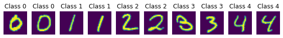
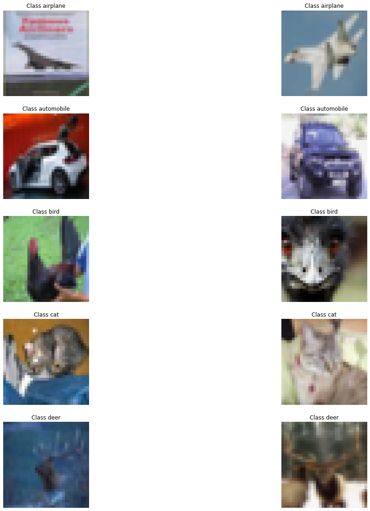
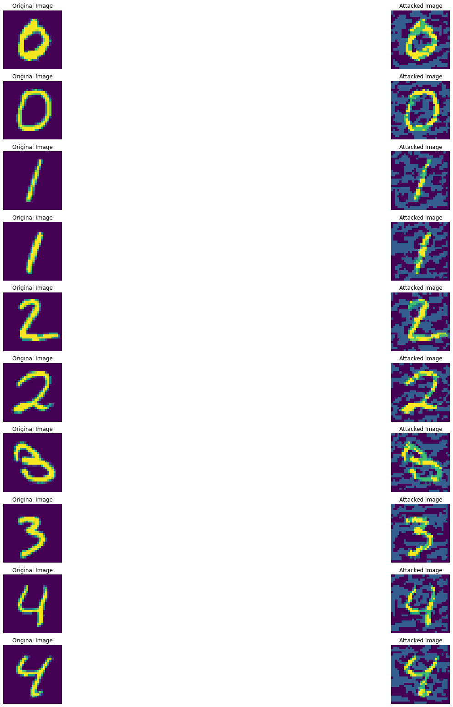
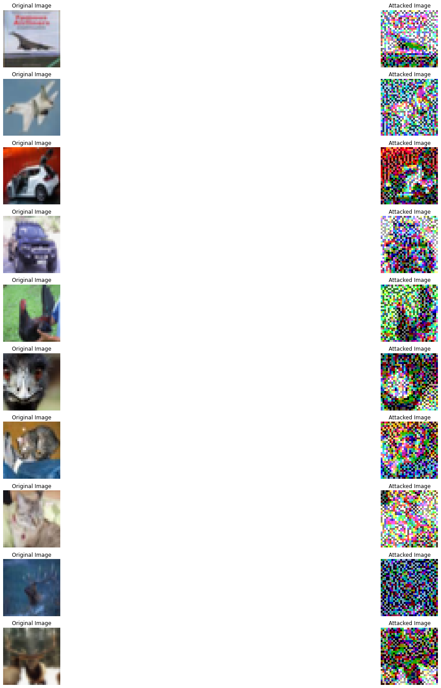
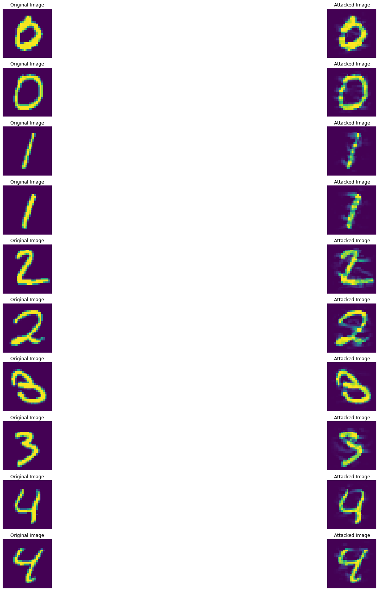
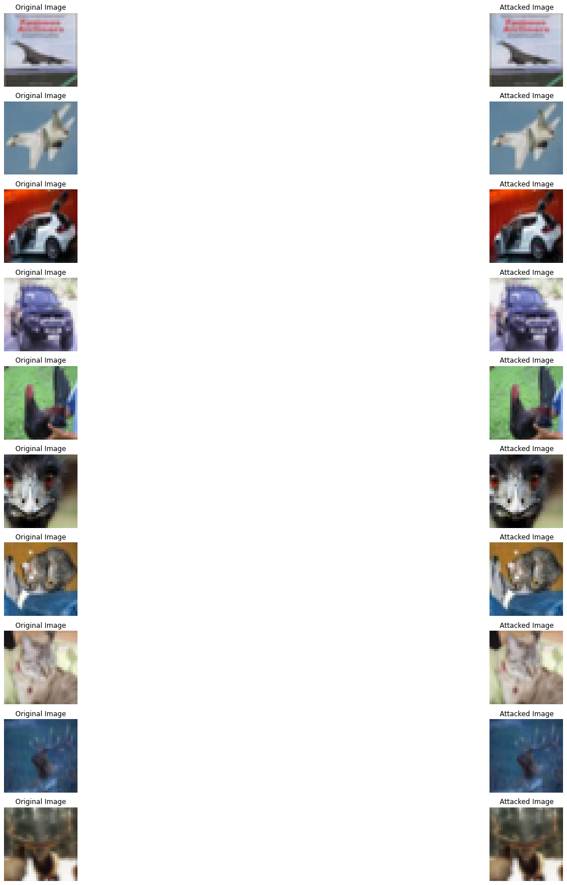

# CS 6220 Programming HW 2
## Abhishek Sharma

## Option 1.1: Understanding security vulnerabilities of using a well-trained DNN models for image classification

### Input Analysis
1) **Provide a summary of your pre-trained models and datasets. For each dataset, provide 10 example inputs under five different classes, 2 per class.**
   1) Summary of models -
      1) *LeNet5 (7-layer CNN) for MNIST* - The model contained 7 layers excluding the input layer. It has 4 CNN layers and 3 dense layers that have been trained on the MNIST dataset. This pre-trained model is taken from https://github.com/git-disl/GTAttackPod website.
      2) *DenseNet-40 for CIFAR10* -  The Densenet paper [1] describes the model as “the lth layer has l inputs, consisting of the feature maps of all preceding convolutional blocks. Its own feature maps are passed on to all L − l subsequent layers. This introduces L(L+1) / 2 connections in an L-layer network, instead of just L, as in traditional feed-forward architectures”. The novelty of this model is that it has dense connectivity where any layer can be directly connected to any of the layers of the network. The pretrained model is trained on CIFAR10 dataset and is taken from https://github.com/git-disl/GTAttackPod website.
      3) *DenseNet-121,161,169 for CIFAR10* - These are similar models to DenseNet40 model for CIFAR10, but with just having many higher layers in the DNN than the DenseNet40. These models have been modified from the original [TorchVision models](https://pytorch.org/vision/stable/models.html) and has been taken from the https://github.com/huyvnphan/PyTorch_CIFAR10 [2]. The accuracy for these models are mentioned [here](https://github.com/huyvnphan/PyTorch_CIFAR10#statistics-of-supported-models)
      4) *VGG for CIFAR10* - These VGG models (of 11,13,16,19 layers) have also been taken from https://github.com/huyvnphan/PyTorch_CIFAR10 [2] and have been modified from the original TorchVision models and trained on CIFAR10 dataset. VGG[3] model is a Convolutional Neural Network, where the images are passed through many Convolutional Layers (for example 16) in order to reduce/extract features about an image. This extracted feature is then passed through a few fully connected network layers in order to finally achieve a classification.
   2) Summary of Dataset -
      1) *MNIST* - MNIST is a dataset of handwritten digits images that has a training set of 60,000 examples, and a test set of 10,000 examples. The images are of size 28x28 and grayscale. The digits are centered in the 28x28 image. There are 10 classes of images, with each class representing one  digit from 0-9.
      
      2) *CIFAR-10* - The CIFAR-10 is an image dataset consisting of 50000 training images and 10000 test images 32x32 color images in 10 classes. Class-wise distribution is equal with 6000 images per class. The 10 classes are airplane, automobile, bird, cat, deer, dog, frog, horse, ship, truck. It is a popular dataset for classification problem, collected at University of Toronto.
      
2) **Provide a summary of the two attack algorithms of your choice.**
   1) *FGSM Attack* - FGSM was introduced by Goodfellow et al. in their paper, “Explaining and Harnessing Adversarial Examples”[4]. It exploits the gradients of a neural network to build an adversarial image. FGSM calculates the loss function after forward propagation of an image and then calculates the gradient with for every pixels of the image. It then uses the sign of the gradients to shift the pixels of the image in the direction of sign by a small amount that maximizes the loss  above. The resulting image looks identical to humans but is misclassified by the model as we moved the pixels to maximize the loss.
   2) *DeepFool Attack* - DeepFool was introduced by Moosavi-Dezfooli et al. In the paper “DeepFool: A Simple and Accurate Method to Fool Deep Neural Networks”[5]. It is a Whitebox attack in which the close direction to the decision boundary is computed in every step to update the image. It is equivalent to minimizing the decision boundary between the various classes as a result of which the model misclassifies the adversarial images.
3) Provide the attack examples you generated for the 10 examples you listed in 1)
   1) *FGSM Attack* 
      1) MNIST Dataset - 
      2) CIFAR Dataset - 
   2) *DeepFool Attack*
      1) MNIST Dataset - 
      2) CIFAR Dataset - 

### Output Analysis
1) **Include a note that you have provided your answer to the questionnaire posted as quiz 1 on Canvas (under quizzes), refer to requirement 2) above**
   1) I have completed the Quiz 1
2) **Provide test accuracy measurement and average test time per example of the two well trained models under no attack.**

| Model and Dataset | Test accuracy measurement | Avg Test Time Per Example |
| CNN 7-layer on MNIST | 99.43% | 0.000196 seconds |
| DenseNet40 on CIFAR10 | 94.84% | 0.012034 seconds |
   
## References
[1] Huang, Gao, et al. "Densely connected convolutional networks." Proceedings of the IEEE conference on computer vision and pattern recognition. 2017

[2] Huy Phan. (2021). huyvnphan/PyTorch_CIFAR10 (v3.0.1). Zenodo. https://doi.org/10.5281/zenodo.4431043

[3] Simonyan, Karen, and Andrew Zisserman. "Very deep convolutional networks for large-scale image recognition." arXiv preprint arXiv:1409.1556 (2014).

[4] Goodfellow, I.J., Shlens, J. and Szegedy, C., 2014. Explaining and harnessing adversarial examples. arXiv preprint arXiv:1412.6572.

[5] Moosavi-Dezfooli, S.M., Fawzi, A. and Frossard, P., 2016. Deepfool: a simple and accurate method to fool deep neural networks. In Proceedings of the IEEE conference on computer vision and pattern recognition (pp. 2574-2582).