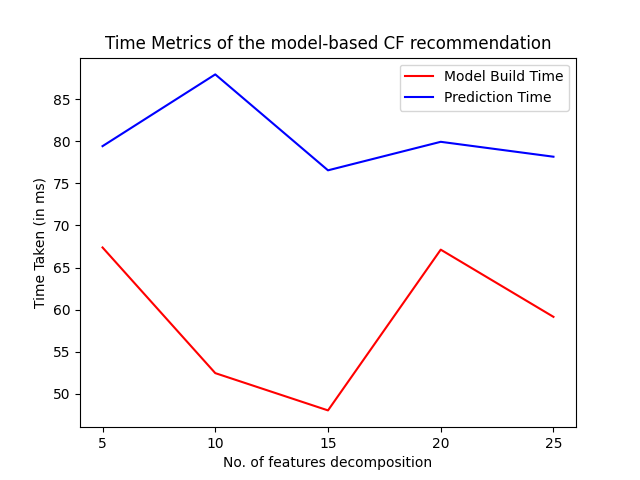
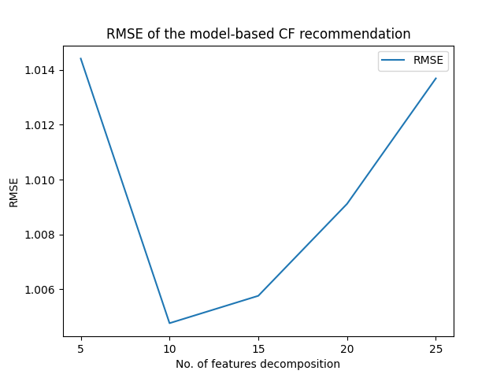

# Programming Assignment 3
## Abhishek Sharma

# Problem 2: Model based Collaborative Filtering

## Installation (Python Library Dependencies)
```
$> python -m pip install jupyter scipy numpy scikit-learn pandas
```
We will be using the Numpy package's SVD for our model. More details can be found on [Numpy's own website/documentation](https://numpy.org/doc/stable/reference/generated/numpy.linalg.svd.html)

## Dataset
I have taken the 100K dataset from [MovieLens](https://grouplens.org/datasets/movielens/). It contains data on people's rating of different movies. The rating will be the one value that we will perform Collaborative Filtering Recommendation/Prediction.

We will be focusing on the ratings part of the dataset for our recommendation and rating prediction.

The ratings dataset consists of four columns -
1. *user_id* - User ID of the user whose rating it is.
2. *movie_id* - The Movie ID of the movie that is being rated.
3. *rating* - The rating by the user for the said movie.
4. *unix_timestamp* - The Unix Timestamp when the rating was recorded from the user.

The number of data-points in this dataset is **100,000**.

Sample data-points -
```
user_id  movie_id  rating  unix_timestamp
     196       242       3       881250949
     186       302       3       891717742
      22       377       1       878887116
     244        51       2       880606923
     166       346       1       886397596
```

## The model, the logic, and the processing
1. First, we split our original dataset into a training-testing split, of which 80% of the data will be for training purposes and the rest 20% for testing.
1. My logic is to first create a user-item matrix using the above training dataset.
   1. Fortunately the pandas library allows a `pivot` method, which takes in 3 columns and allows you to define them as rows, columns and values.
   2. Using this `pivot` method, we are able to get a user-item matrix.
   3. The user-item matrix from this training dataset is of the size **(943x1646)**
2. Now, we take this user-item matrix and normalize it.
   1. The idea behind normalization occurs from the sparseness of the user-item matrix.
   2. A lot of users would not have seen all the possible movies in the dataset. So, you can't expect value for every user-item combination.
   3. Hence, you need to somehow fill these NA values.
   4. For this, I have decided to use the mean of the already rated movies of each users.
   5. The idea behind this decision being that a user can be thought of an average person, reviewing based on his previous reviews.
   6. Now that we have got this full matrix, we normalize the values.
3. After normalizing the user-item matrix, we run it through Singular Value Decomposition (SVD) after choosing the number of features to decompose.
4. **The model** - Singular Value Decomposition (SVD)
   1. It is a linear algebra technique for matrix decomposition.
   2. It involves decomposing a $(m \times n)$ into 3 different matrices of sizes $m \times m$, $m \times n$, $n \times n$.
   3. $X_{m \times n} = U_{m \times r}\Sigma_{r \times r}V_{r \times n}$, where $r$ denotes the number of features you want your original array to be decomposed in.
   4. We use this approach to find the first $r$ important features, and using this we make a prediction, making this type of prediction/recommmnedation "model-based".
5. Since it is SVD, the only hyper-parameter here is the projection dimensions.
6. For our experiment, I have taken 5 different dimensions for projections - 5, 10, 15, 20, 25.

## Source Code
All the code is in the [Jupyter noebook](HW3.ipynb) in the root folder of programming-assignment-3.

## The Output
For all projection dimension output, we have a look at the following output metrics -
1. Model building time
2. Prediction time
3. RMSE for the prediction
4. Sample predictions (for 20 unique users)
5. Top 5 predictions for our choosen golden user - `USER_ID = 196` (There is no reasoning behind choosing this specific user, just wanted to take a user)

### The Output Metrics Table

| No. of dimensions projected | Model build time (in ms) | Prediction Time (for 20381 data-points) (in ms) | RMSE |
|----|----|----|----|
|5|67.38145351409912|79.41782474517822|1.0144148014980479|
|10|52.45695114135742|87.93885707855225|1.0047620221424585|
|15|48.03004264831543|76.54550075531006|1.005761104936141|
|20|67.12355613708496|79.93218898773193|1.0091169319885724|
|25|59.14216041564941|78.16145420074463|1.0136924028513037|

### Top 5 recommendations for our choosen user
1. 5 Dimensions Projected - Top 5 movies recommended for the choosen UserID 196 with predicted ratings
   1. That Old Feeling (1997); Predicted Rating - 5.0
   2. Price Above Rubies, A (1998); Predicted Rating - 5.0
   3. Umbrellas of Cherbourg, The (Parapluies de Cherbourg, Les) (1964); Predicted Rating - 5.0
   4. Young Guns II (1990); Predicted Rating - 5.0
   5. Damsel in Distress, A (1937); Predicted Rating - 5.0
2. 10 Dimensions Projected - Top 5 movies recommended for the choosen UserID 196 with predicted ratings
   1. Damsel in Distress, A (1937); Predicted Rating - 5.0
   2. Country Life (1994); Predicted Rating - 5.0
   3. Great Day in Harlem, A (1994); Predicted Rating - 5.0
   4. Umbrellas of Cherbourg, The (Parapluies de Cherbourg, Les) (1964); Predicted Rating - 5.0
   5. Young Guns II (1990); Predicted Rating - 5.0
3. 15 Dimensions Projected - Top 5 movies recommended for the choosen UserID 196 with predicted ratings
   1. Young Guns II (1990); Predicted Rating - 5.0
   2. Germinal (1993); Predicted Rating - 5.0
   3. Hush (1998); Predicted Rating - 5.0
   4. Quartier Mozart (1992); Predicted Rating - 5.0
   5. Country Life (1994); Predicted Rating - 5.0
4. 20 Dimensions Projected - Top 5 movies recommended for the choosen UserID 196 with predicted ratings
   1. That Old Feeling (1997); Predicted Rating - 5.0
   2. Hush (1998); Predicted Rating - 5.0
   3. Boys, Les (1997); Predicted Rating - 5.0
   4. Country Life (1994); Predicted Rating - 5.0
   5. Quartier Mozart (1992); Predicted Rating - 5.0
5. 25 Dimensions Projected - Top 5 movies recommended for the choosen UserID 196 with predicted ratings
   1. Young Guns II (1990); Predicted Rating - 5.0
   2. Quartier Mozart (1992); Predicted Rating - 5.0
   3. Umbrellas of Cherbourg, The (Parapluies de Cherbourg, Les) (1964); Predicted Rating - 5.0
   4. Country Life (1994); Predicted Rating - 5.0
   5. That Old Feeling (1997); Predicted Rating - 5.0

### Raw Output
```
--------------------------------------------------------------------
1. Building model starting for 5 SVD Projection Dimension 
2. Built model for 5 SVD Projection Dimension in 0.6738145351409912s
3. Predictions start...
4. Predictions complete in 0.7941782474517822s for 20381 data-points
Top 5 movies recommended for the choosen UserID 196 with predicted ratings
1. That Old Feeling (1997); Predicted Rating - 5.0
2. Price Above Rubies, A (1998); Predicted Rating - 5.0
3. Umbrellas of Cherbourg, The (Parapluies de Cherbourg, Les) (1964); Predicted Rating - 5.0
4. Young Guns II (1990); Predicted Rating - 5.0
5. Damsel in Distress, A (1937); Predicted Rating - 5.0
5. Predictions Output (For 20 unique users)
 user_id  movie_id  actual_rating  pred_rating
     196      1118              4     3.698713
     186       939              5     2.390029
      22        29              1     2.500097
     244      1095              2     2.502977
     166       894              4     3.258764
     298       284              4     3.261085
     115       508              5     3.664055
     253       465              5     3.567740
     305       464              3     3.630944
       6       310              2     3.499065
      62       249              2     3.225264
     286       762              2     3.431377
     200       405              3     4.156986
     210        96              4     4.300935
     224       555              3     1.986584
     303       678              1     2.453394
     122       570              3     3.086946
     194       518              4     3.377405
     291      1042              4     3.003954
     234       153              3     3.374926
6. RMSE for 5 SVD Projection Dimension = 1.0144148014980479
--------------------------------------------------------------------
1. Building model starting for 10 SVD Projection Dimension 
2. Built model for 10 SVD Projection Dimension in 0.5245695114135742s
3. Predictions start...
4. Predictions complete in 0.8793885707855225s for 20381 data-points
Top 5 movies recommended for the choosen UserID 196 with predicted ratings
1. Damsel in Distress, A (1937); Predicted Rating - 5.0
2. Country Life (1994); Predicted Rating - 5.0
3. Great Day in Harlem, A (1994); Predicted Rating - 5.0
4. Umbrellas of Cherbourg, The (Parapluies de Cherbourg, Les) (1964); Predicted Rating - 5.0
5. Young Guns II (1990); Predicted Rating - 5.0
5. Predictions Output (For 20 unique users)
 user_id  movie_id  actual_rating  pred_rating
     196      1118              4     3.718600
     186       939              5     2.385290
      22        29              1     2.534051
     244      1095              2     2.504098
     166       894              4     3.294351
     298       284              4     3.271050
     115       508              5     3.751777
     253       465              5     3.533453
     305       464              3     3.662953
       6       310              2     3.450246
      62       249              2     3.235094
     286       762              2     3.261747
     200       405              3     4.188873
     210        96              4     4.302672
     224       555              3     1.994571
     303       678              1     2.445806
     122       570              3     3.075109
     194       518              4     3.417084
     291      1042              4     3.021802
     234       153              3     3.395112
6. RMSE for 10 SVD Projection Dimension = 1.0047620221424585
--------------------------------------------------------------------
1. Building model starting for 15 SVD Projection Dimension 
2. Built model for 15 SVD Projection Dimension in 0.4803004264831543s
3. Predictions start...
4. Predictions complete in 0.7654550075531006s for 20381 data-points
Top 5 movies recommended for the choosen UserID 196 with predicted ratings
1. Young Guns II (1990); Predicted Rating - 5.0
2. Germinal (1993); Predicted Rating - 5.0
3. Hush (1998); Predicted Rating - 5.0
4. Quartier Mozart (1992); Predicted Rating - 5.0
5. Country Life (1994); Predicted Rating - 5.0
5. Predictions Output (For 20 unique users)
 user_id  movie_id  actual_rating  pred_rating
     196      1118              4     3.718025
     186       939              5     2.382783
      22        29              1     2.504022
     244      1095              2     2.502807
     166       894              4     3.323815
     298       284              4     3.247237
     115       508              5     3.778859
     253       465              5     3.570397
     305       464              3     3.717953
       6       310              2     3.420256
      62       249              2     3.213191
     286       762              2     3.210521
     200       405              3     4.323562
     210        96              4     4.174446
     224       555              3     2.004141
     303       678              1     2.357816
     122       570              3     3.097145
     194       518              4     3.507506
     291      1042              4     3.023392
     234       153              3     3.154948
6. RMSE for 15 SVD Projection Dimension = 1.005761104936141
--------------------------------------------------------------------
1. Building model starting for 20 SVD Projection Dimension 
2. Built model for 20 SVD Projection Dimension in 0.6712355613708496s
3. Predictions start...
4. Predictions complete in 0.7993218898773193s for 20381 data-points
Top 5 movies recommended for the choosen UserID 196 with predicted ratings
1. That Old Feeling (1997); Predicted Rating - 5.0
2. Hush (1998); Predicted Rating - 5.0
3. Boys, Les (1997); Predicted Rating - 5.0
4. Country Life (1994); Predicted Rating - 5.0
5. Quartier Mozart (1992); Predicted Rating - 5.0
5. Predictions Output (For 20 unique users)
 user_id  movie_id  actual_rating  pred_rating
     196      1118              4     3.731503
     186       939              5     2.348790
      22        29              1     2.444128
     244      1095              2     2.501897
     166       894              4     3.329592
     298       284              4     3.273017
     115       508              5     3.835457
     253       465              5     3.551434
     305       464              3     3.716429
       6       310              2     3.376951
      62       249              2     3.152784
     286       762              2     3.279764
     200       405              3     4.130055
     210        96              4     4.228332
     224       555              3     2.013694
     303       678              1     2.677996
     122       570              3     3.107144
     194       518              4     3.598536
     291      1042              4     3.022759
     234       153              3     3.257367
6. RMSE for 20 SVD Projection Dimension = 1.0091169319885724
--------------------------------------------------------------------
1. Building model starting for 25 SVD Projection Dimension 
2. Built model for 25 SVD Projection Dimension in 0.5914216041564941s
3. Predictions start...
4. Predictions complete in 0.7816145420074463s for 20381 data-points
Top 5 movies recommended for the choosen UserID 196 with predicted ratings
1. Young Guns II (1990); Predicted Rating - 5.0
2. Quartier Mozart (1992); Predicted Rating - 5.0
3. Umbrellas of Cherbourg, The (Parapluies de Cherbourg, Les) (1964); Predicted Rating - 5.0
4. Country Life (1994); Predicted Rating - 5.0
5. That Old Feeling (1997); Predicted Rating - 5.0
5. Predictions Output (For 20 unique users)
 user_id  movie_id  actual_rating  pred_rating
     196      1118              4     3.727714
     186       939              5     2.319772
      22        29              1     2.424754
     244      1095              2     2.497755
     166       894              4     3.324334
     298       284              4     3.224725
     115       508              5     3.850971
     253       465              5     3.589355
     305       464              3     3.763882
       6       310              2     3.418445
      62       249              2     3.132746
     286       762              2     3.117002
     200       405              3     4.168350
     210        96              4     4.023223
     224       555              3     2.016962
     303       678              1     2.819192
     122       570              3     3.107726
     194       518              4     3.738963
     291      1042              4     3.037147
     234       153              3     3.368786
6. RMSE for 25 SVD Projection Dimension = 1.0136924028513037

```

## Analysis

### Comparison between memory-based and model-based CF approaches
Well, as you can see, it is quite easy to make model-based Collaborative Filtering recommendation model, especially through SVD. 
- Model-based CF approach does not suffer the curse of dimensionality. By using SVD's dimension projection method, I could reduce the amount of dimensions that I had to deal with while making a recommendation, which could not be possible if doing it with a memory-based approach.
- Model-based CF also helped me reduce my computational costs, as the only operations that I had to do were some matrix operations, which current hardware do it within a second (as shown by my SVD Model build times). In order to compute something memory-based, you would have to compute rating matrices evey time the system tries to find some similar user/items and makes a prediction - increasing computation costs.
- Our SVD-based recommendation system would work weel in real-world scenarios, as we have already got the SVD values, that can be applied to be used for generating recommendation without much processing. Whereas in model-based approaches, you would have to build the rating matrix again in order to adjust for new recommendation predictions.

### Comparison between different projection dimensions
- From the output metric table, we can see that model building times and prediction times is not that dependent on the dimensions projected. It is kind of all over the place.
- This can be seen in the following plot
- 
- RMSE values on the other hand can tell us some story -
- 
- As you can see the RMSE is lowest when we use the top 10 features. This means top 10 features are sufficient enough to tell the story about this recommendation dataset. Adding more features is causing some form of over-fitting, which is why the RMSE is deteriorating. Hence, 10 features are ideal for this CF model.

## References 
1. http://www.gregreda.com/2013/10/26/using-pandas-on-the-movielens-dataset/
2. https://github.com/bmidhun1/recommender_system/blob/master/AV_recommender_purchase_data.ipynb
3. https://towardsdatascience.com/beginners-guide-to-creating-an-svd-recommender-system-1fd7326d1f65
4. https://medium.com/analytics-vidhya/a-model-based-approach-to-build-a-recommendation-engine-1519d347cd22
5. https://medium.com/analytics-vidhya/collaborative-based-recommendation-system-using-svd-9adc5b6b3b8
6. https://analyticsindiamag.com/singular-value-decomposition-svd-application-recommender-system/
7. https://realpython.com/build-recommendation-engine-collaborative-filtering/
8. http://www.gregreda.com/2013/10/26/using-pandas-on-the-movielens-dataset/
9. https://www.geeksforgeeks.org/singular-value-decomposition-svd/