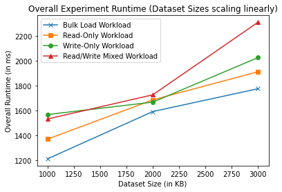
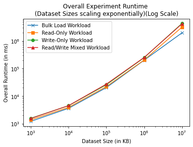
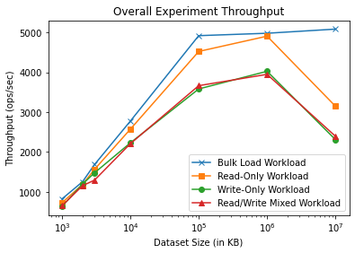
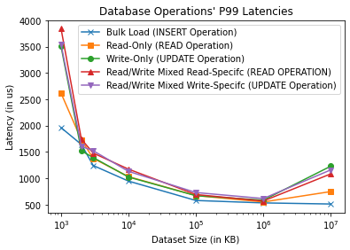

# Programming Assignment 4
## Abhishek Sharma
# Problem 1.1 - Performance Measurement of Key-Value Store

## Folder Structure
```
|- ycsb-mongodb-binding-0.17.0  -> The folder that is downloaded as 
||                                 the release package for YCSB
||- assignment-workloads        -> This folder contains all 
||                                 workload configuration file for 
||                                 the assignment
||- bin                         -> This folder contains YCSB 
||                                 binaries
||- lib                         -> This folder contains all      
|                                  libraries for YCSB binaries
|- REPORT.md                    -> This report
|- *.png                        -> Graph plots used in the report
|- plot-graph.ipynb             -> Jupyter notebook, used to create 
                                  graphs
```

## Database Technology

I have chosen MongoDB (https://mongodb.com) database for this assignment. The installation was quite straight-forward and the steps can be found on the following link - https://www.mongodb.com/docs/manual/tutorial/install-mongodb-on-ubuntu/

## Workload and Experiment Benchmark Tool

I am using the open source [Yahoo! Cloud Serving Benchmark (YCSB)](https://ycsb.site) tool for all my workload benchmarking. The YCSB tool provides benchmarking tools for tons of different databses, MongoDB included. In addition, it also provides the ability to generate a data and perform specific workload benchmark and tweak different performance/configuration parameter about the benchmarks through properties files.

To set up YCSB for MongoDB, I followed the following steps - https://github.com/brianfrankcooper/YCSB/blob/master/mongodb/README.md

## Dataset Structure
Each record/document is of 1 KB records (10 fields, 100 bytes each, plus key) and is automatically generated by the YCSB Workload benchmark tool.

An example of such a record is -
```
{
    _id: 'user5228908089637460490',
    field1: Binary(Buffer.from("24286c2243333e2674275567244e3f29282c2e4c23294f7d25392c392f2423483531562b353566223070283f36392b3e38567d3b367c322c2c215b653d252c2035282c29762b506b2a412f384375354d2d203e7c3d3c7a3a5c213e563724303a333c7222", "hex"), 0),
    field0: Binary(Buffer.from("3857752729723c2234214a2d365e3928497938312a3d5b3b395e612e373e3e5c3325256a254f33283f3c3f4d733b3976283a3c253778354b633e247226232e29572d36377a234433345039295e2534426f3323682b58733e4e313c3c3634246a274d652f", "hex"), 0),
    field7: Binary(Buffer.from("34512535522b36377c2737623f4e272435383a206e2235602d4033384d272a5637203e343d40212c5721383f7a2e497f364c313c56312a487922203c3c4b312c4f39394e3f305123214d6f3f3e303b523530433b354c3339502d3f352c344239205c6f2a", "hex"), 0),
    field6: Binary(Buffer.from("2c5c6b2a3c6c3d4f7d332a2a313d6a2343612c5a692f2a7e3f4d292059352f312a304a373f4d6b2a5d2f2c3b7637482535497732277a3a492b2c416b2f533b2d4f372a5367363f7c393422383f703b323c285a792d3c7e3f406b39266c2247793b376e37", "hex"), 0),
    field9: Binary(Buffer.from("2f4629203b6c263d26252e22284f79234e7d2c4c6f275f3d2d5027242b7c325935355f25224f2d31582f2e4a653f552727482d2c23643c5a37312b362c52212d3f342d4329254137213620312e30262b2c31396c385b6b274e272c492d3854392932642b", "hex"), 0),
    field8: Binary(Buffer.from("2e2572323d74295e2531307e3a2522202966265525252c7a2d407f2359233634362944732c2b2a24223a3c297e2e56612259693b286c31463b352f6e2d287232217436413f21277e39322c21446b213338315a7b2144732e353e3928683b38263b382a2d", "hex"), 0),
    field3: Binary(Buffer.from("3647653a206a3e3f7a2b422f384737315571342d64374a31223d38355c2f34587726402d36403929512b204175275c753547672f572325326233252e2b373c3530323d567f2b56753f472f3d5c332039282129303c40332832382d38662a50672955793e", "hex"), 0),
    field2: Binary(Buffer.from("213e7c2a5965322b2e392f262e2e363d2232224c332532703c35242c29703b4d3539476b26487f322b3a313522244c21223f743e3566284379225873304f732f42672238702f5a653e577f2e5e23244d753e5b672f32603e452b373b222036662a46372c", "hex"), 0),
    field5: Binary(Buffer.from("3f31622e3f2834403b28546d365c7b2a347e235e612f386a2d353429582d3d357e235363284f7b2f3d3a2f212c2153693225262c527f3023243d4c7d285d27283d26363d6a374979315a672f2d6c3223603e4a27354a672e442f20542128442b3e212a31", "hex"), 0),
    field4: Binary(Buffer.from("2a2b2a31292e2026702a36343136743a4e6f215f792a463121282235572934473920503920467b262d3e3f247c37592b3551372823303b2a74333260325c212434222029762f376c21513f2d5b33384727242f602357673e2c203f392e2c3d2c3c3a662f", "hex"), 0)
}
```
All these records are maintained in the database named `ycsb`, with the document collection name, `usertable`.

## Experiment Setup
1. Each experiment will have only two varying parameters - the total number of records and the number of records on which operations are happenning.
2. Both of these parameters will always be set to the same value in order to scale the record counts.
3. There will be four workload configuration -
   1. **Bulk Load Dataset** - This will load dataset, which will have the said number of records.
   2. **Read-only Dataset** - This will perform random read operations on the records.
   3. **Write-only Dataset** - This will perform random update operations on the records.
   4. **Read/Write Mix Workloads** - This will perform 50% Read and 50% Write, or update operations on the records.
4. These workload operations are distributed using the zipfian distribution.
5. All these workload configuration parameters are described in [this workload parameter folder](ycsb-mongodb-binding-0.17.0/assignment-workloads/).
6. Before each different size workload, I clear the database to rebuild the database using the loading operation.
7. All the commands that I have used to run the experiment can be found in the subsub-sections that I list down below.
8. There are seven(7) dataset sizes that I am targeting
   1. 1MB
   2. 2MB
   3. 3MB
   4. 10MB
   5. 100MB
   6. 1GB
   7. 10GB
9. The first 3 dataset sizes are to see how performance scales when dataset scales linearly, and the others are to see performance scaling with exponential-level dataset size scaling.

Below are the outputs and commands for all the experiments. **Please use the right-pointing triangle to reveal more details about each dataset**.

<details>
<summary><b> 1000 records dataset (~1MB) </b></summary>

1. Load Dataset
```
❯ ./bin/ycsb load mongodb -s -P assignment-workloads/load-workload -p recordcount=1000
...
YCSB Client 0.17.0

Loading workload...
Starting test.
2022-10-20 23:22:10:502 0 sec: 0 operations; est completion in 0 second 
mongo client connection created with mongodb://localhost:27017/ycsb?w=1
...
[OVERALL], RunTime(ms), 1211
[OVERALL], Throughput(ops/sec), 825.7638315441784
...
[INSERT], Operations, 1000
[INSERT], AverageLatency(us), 695.263
[INSERT], MinLatency(us), 152
[INSERT], MaxLatency(us), 73983
[INSERT], 95thPercentileLatency(us), 1318
[INSERT], 99thPercentileLatency(us), 1963
[INSERT], Return=OK, 1000
```
2. Read-Only Dataset
```
❯ ./bin/ycsb run mongodb -s -P assignment-workloads/read-only-workload -p recordcount=1000
...
YCSB Client 0.17.0

Loading workload...
Starting test.
2022-10-20 23:48:16:047 0 sec: 0 operations; est completion in 0 second 
mongo client connection created with mongodb://localhost:27017/ycsb?w=1
...
[OVERALL], RunTime(ms), 1370
[OVERALL], Throughput(ops/sec), 729.92700729927
...
[READ], Operations, 1000
[READ], AverageLatency(us), 826.64
[READ], MinLatency(us), 161
[READ], MaxLatency(us), 64447
[READ], 95thPercentileLatency(us), 1530
[READ], 99thPercentileLatency(us), 2617
[READ], Return=OK, 1000
...
```
3. Write-Only (Update-Only) Dataset
```
❯ ./bin/ycsb run mongodb -s -P assignment-workloads/write-only-workload -p recordcount=1000
...
YCSB Client 0.17.0

Loading workload...
Starting test.
2022-10-21 00:11:08:834 0 sec: 0 operations; est completion in 0 second 
mongo client connection created with mongodb://localhost:27017/ycsb?w=1
...
[OVERALL], RunTime(ms), 1568
[OVERALL], Throughput(ops/sec), 637.7551020408164
...
[UPDATE], Operations, 1000
[UPDATE], AverageLatency(us), 958.0
[UPDATE], MinLatency(us), 178
[UPDATE], MaxLatency(us), 65663
[UPDATE], 95thPercentileLatency(us), 2211
[UPDATE], 99thPercentileLatency(us), 3505
[UPDATE], Return=OK, 1000
```
4. Read-Write Mixed Workload
```
❯ ./bin/ycsb run mongodb -s -P assignment-workloads/read-write-workload -p recordcount=1000
...
YCSB Client 0.17.0

Loading workload...
Starting test.
2022-10-21 00:18:18:714 0 sec: 0 operations; est completion in 0 second 
mongo client connection created with mongodb://localhost:27017/ycsb?w=1
...
[OVERALL], RunTime(ms), 1532
[OVERALL], Throughput(ops/sec), 652.7415143603133
...
[READ], Operations, 496
[READ], AverageLatency(us), 920.4092741935484
[READ], MinLatency(us), 194
[READ], MaxLatency(us), 13647
[READ], 95thPercentileLatency(us), 2189
[READ], 99thPercentileLatency(us), 3841
[READ], Return=OK, 496
...
[UPDATE], Operations, 504
[UPDATE], AverageLatency(us), 1020.0555555555555
[UPDATE], MinLatency(us), 206
[UPDATE], MaxLatency(us), 60959
[UPDATE], 95thPercentileLatency(us), 2343
[UPDATE], 99thPercentileLatency(us), 3543
[UPDATE], Return=OK, 504
```
</details>

<details>
<summary><b> 2000 records dataset (~2MB) </b></summary>

1. Load Dataset
```
❯ ./bin/ycsb load mongodb -s -P assignment-workloads/load-workload -p recordcount=2000 -p operationcount=2000
...
YCSB Client 0.17.0

Loading workload...
Starting test.
2022-10-21 00:44:00:341 0 sec: 0 operations; est completion in 0 second 
mongo client connection created with mongodb://localhost:27017/ycsb?w=1
...
[OVERALL], RunTime(ms), 1592
[OVERALL], Throughput(ops/sec), 1256.2814070351758
...
[INSERT], Operations, 2000
[INSERT], AverageLatency(us), 532.461
[INSERT], MinLatency(us), 146
[INSERT], MaxLatency(us), 73663
[INSERT], 95thPercentileLatency(us), 1051
[INSERT], 99thPercentileLatency(us), 1644
[INSERT], Return=OK, 2000
```
2. Read-Only Dataset
```
❯ ./bin/ycsb run mongodb -s -P assignment-workloads/read-only-workload -p recordcount=2000 -p operationcount=2000
YCSB Client 0.17.0

Loading workload...
Starting test.
2022-10-21 00:44:56:254 0 sec: 0 operations; est completion in 0 second 
mongo client connection created with mongodb://localhost:27017/ycsb?w=1
...
[OVERALL], RunTime(ms), 1686
[OVERALL], Throughput(ops/sec), 1186.2396204033214
...
[READ], Operations, 2000
[READ], AverageLatency(us), 585.2645
[READ], MinLatency(us), 151
[READ], MaxLatency(us), 61663
[READ], 95thPercentileLatency(us), 1176
[READ], 99thPercentileLatency(us), 1731
[READ], Return=OK, 2000
...
```
3. Write-only (Update-only) Dataset
```
❯ ./bin/ycsb run mongodb -s -P assignment-workloads/write-only-workload -p recordcount=2000 -p operationcount=2000
...
YCSB Client 0.17.0

Loading workload...
Starting test.
2022-10-21 08:55:19:868 0 sec: 0 operations; est completion in 0 second 
mongo client connection created with mongodb://localhost:27017/ycsb?w=1
...
[OVERALL], RunTime(ms), 1668
[OVERALL], Throughput(ops/sec), 1199.0407673860911
...
[UPDATE], Operations, 2000
[UPDATE], AverageLatency(us), 592.7745
[UPDATE], MinLatency(us), 166
[UPDATE], MaxLatency(us), 61919
[UPDATE], 95thPercentileLatency(us), 1136
[UPDATE], 99thPercentileLatency(us), 1523
[UPDATE], Return=OK, 2000
```
4. Read-Write Mixed Dataset
```
❯ ./bin/ycsb run mongodb -s -P assignment-workloads/read-write-workload -p recordcount=2000 -p operationcount=2000
...
YCSB Client 0.17.0

Loading workload...
Starting test.
2022-10-21 08:56:24:723 0 sec: 0 operations; est completion in 0 second 
mongo client connection created with mongodb://localhost:27017/ycsb?w=1
...
[OVERALL], RunTime(ms), 1727
[OVERALL], Throughput(ops/sec), 1158.0775911986102
...
[READ], Operations, 998
[READ], AverageLatency(us), 597.7354709418838
[READ], MinLatency(us), 156
[READ], MaxLatency(us), 9847
[READ], 95thPercentileLatency(us), 1194
[READ], 99thPercentileLatency(us), 1744
[READ], Return=OK, 998
...
[UPDATE], Operations, 1002
[UPDATE], AverageLatency(us), 653.4690618762475
[UPDATE], MinLatency(us), 169
[UPDATE], MaxLatency(us), 56543
[UPDATE], 95thPercentileLatency(us), 1136
[UPDATE], 99thPercentileLatency(us), 1607
[UPDATE], Return=OK, 1002
```
</details>

<details>
<summary><b> 3000 records dataset (~3MB) </b></summary>

1. Load Dataset
```
❯ ./bin/ycsb load mongodb -s -P assignment-workloads/load-workload -p recordcount=3000 -p operationcount=3000
...
YCSB Client 0.17.0

Loading workload...
Starting test.
2022-10-21 08:58:30:905 0 sec: 0 operations; est completion in 0 second 
mongo client connection created with mongodb://localhost:27017/ycsb?w=1
...
[OVERALL], RunTime(ms), 1776
[OVERALL], Throughput(ops/sec), 1689.1891891891892
...
[INSERT], Operations, 3000
[INSERT], AverageLatency(us), 416.44233333333335
[INSERT], MinLatency(us), 145
[INSERT], MaxLatency(us), 73151
[INSERT], 95thPercentileLatency(us), 825
[INSERT], 99thPercentileLatency(us), 1244
[INSERT], Return=OK, 3000
```
2. Read-Only Dataset
```
❯ ./bin/ycsb run mongodb -s -P assignment-workloads/read-only-workload -p recordcount=3000 -p operationcount=3000
...
YCSB Client 0.17.0

Loading workload...
Starting test.
2022-10-21 09:01:21:175 0 sec: 0 operations; est completion in 0 second 
mongo client connection created with mongodb://localhost:27017/ycsb?w=1
...
[OVERALL], RunTime(ms), 1913
[OVERALL], Throughput(ops/sec), 1568.2174594877156
...
[READ], Operations, 3000
[READ], AverageLatency(us), 479.317
[READ], MinLatency(us), 147
[READ], MaxLatency(us), 63903
[READ], 95thPercentileLatency(us), 941
[READ], 99thPercentileLatency(us), 1380
[READ], Return=OK, 3000
...
```
3. Write-only (Update-only) Dataset
```
❯ ./bin/ycsb run mongodb -s -P assignment-workloads/write-only-workload -p recordcount=3000 -p operationcount=3000
...
YCSB Client 0.17.0

Loading workload...
Starting test.
2022-10-21 09:03:18:322 0 sec: 0 operations; est completion in 0 second 
mongo client connection created with mongodb://localhost:27017/ycsb?w=1
...
[OVERALL], RunTime(ms), 2027
[OVERALL], Throughput(ops/sec), 1480.0197335964478
...
[UPDATE], Operations, 3000
[UPDATE], AverageLatency(us), 509.8156666666667
[UPDATE], MinLatency(us), 164
[UPDATE], MaxLatency(us), 60511
[UPDATE], 95thPercentileLatency(us), 1002
[UPDATE], 99thPercentileLatency(us), 1395
[UPDATE], Return=OK, 3000
```
4. Read-Write Mixed Dataset
```
❯ ./bin/ycsb run mongodb -s -P assignment-workloads/read-write-workload -p recordcount=3000 -p operationcount=3000
...
YCSB Client 0.17.0

Loading workload...
Starting test.
2022-10-21 09:03:48:741 0 sec: 0 operations; est completion in 0 second 
mongo client connection created with mongodb://localhost:27017/ycsb?w=1
...
[OVERALL], RunTime(ms), 2312
[OVERALL], Throughput(ops/sec), 1297.5778546712802
...
[READ], Operations, 1487
[READ], AverageLatency(us), 578.0316072629455
[READ], MinLatency(us), 151
[READ], MaxLatency(us), 9215
[READ], 95thPercentileLatency(us), 1072
[READ], 99thPercentileLatency(us), 1480
[READ], Return=OK, 1487
...
[UPDATE], Operations, 1513
[UPDATE], AverageLatency(us), 625.8565763384005
[UPDATE], MinLatency(us), 163
[UPDATE], MaxLatency(us), 58399
[UPDATE], 95thPercentileLatency(us), 1107
[UPDATE], 99thPercentileLatency(us), 1524
[UPDATE], Return=OK, 1513
```
</details>

<details>
<summary><b> 10000 records dataset (~10MB) </b></summary>

1. Load Dataset
```
❯ ./bin/ycsb load mongodb -s -P assignment-workloads/load-workload -p recordcount=10000 -p operationcount=10000
...
YCSB Client 0.17.0

Loading workload...
Starting test.
2022-10-21 12:58:16:699 0 sec: 0 operations; est completion in 0 second 
mongo client connection created with mongodb://localhost:27017/ycsb?w=1
DBWrapper: report latency for each error is false and specific error codes to track for latency are: []
...
[OVERALL], RunTime(ms), 3604
[OVERALL], Throughput(ops/sec), 2774.694783573807
...
[INSERT], Operations, 10000
[INSERT], AverageLatency(us), 303.8574
[INSERT], MinLatency(us), 121
[INSERT], MaxLatency(us), 79999
[INSERT], 95thPercentileLatency(us), 604
[INSERT], 99thPercentileLatency(us), 948
[INSERT], Return=OK, 10000
```
2. Read-Only Dataset
```
❯ ./bin/ycsb run mongodb -s -P assignment-workloads/read-only-workload -p recordcount=10000 -p operationcount=10000
...
YCSB Client 0.17.0

Loading workload...
Starting test.
2022-10-21 13:00:16:413 0 sec: 0 operations; est completion in 0 second 
mongo client connection created with mongodb://localhost:27017/ycsb?w=1
...
[OVERALL], RunTime(ms), 3888
[OVERALL], Throughput(ops/sec), 2572.01646090535
...
[READ], Operations, 10000
[READ], AverageLatency(us), 331.8481
[READ], MinLatency(us), 117
[READ], MaxLatency(us), 60543
[READ], 95thPercentileLatency(us), 696
[READ], 99thPercentileLatency(us), 1033
[READ], Return=OK, 10000
...
```
3. Write-only (Update-only) Dataset
```
❯ ./bin/ycsb run mongodb -s -P assignment-workloads/write-only-workload -p recordcount=10000 -p operationcount=10000
...
YCSB Client 0.17.0

Loading workload...
Starting test.
2022-10-21 13:02:07:420 0 sec: 0 operations; est completion in 0 second 
mongo client connection created with mongodb://localhost:27017/ycsb?w=1
...
[OVERALL], RunTime(ms), 4486
[OVERALL], Throughput(ops/sec), 2229.157378510923
...
[UPDATE], Operations, 10000
[UPDATE], AverageLatency(us), 387.5534
[UPDATE], MinLatency(us), 136
[UPDATE], MaxLatency(us), 57599
[UPDATE], 95thPercentileLatency(us), 722
[UPDATE], 99thPercentileLatency(us), 1025
[UPDATE], Return=OK, 10000
```
4. Read-Write Mixed Dataset
```
❯ ./bin/ycsb run mongodb -s -P assignment-workloads/read-write-workload -p recordcount=10000 -p operationcount=10000
...
YCSB Client 0.17.0

Loading workload...
Starting test.
2022-10-21 13:02:56:480 0 sec: 0 operations; est completion in 0 second 
mongo client connection created with mongodb://localhost:27017/ycsb?w=1
...
[OVERALL], RunTime(ms), 4526
[OVERALL], Throughput(ops/sec), 2209.456473707468
...
[READ], Operations, 5035
[READ], AverageLatency(us), 374.1527308838133
[READ], MinLatency(us), 123
[READ], MaxLatency(us), 9599
[READ], 95thPercentileLatency(us), 732
[READ], 99thPercentileLatency(us), 1175
[READ], Return=OK, 5035
...
[UPDATE], Operations, 4965
[UPDATE], AverageLatency(us), 414.08580060422963
[UPDATE], MinLatency(us), 140
[UPDATE], MaxLatency(us), 69311
[UPDATE], 95thPercentileLatency(us), 743
[UPDATE], 99thPercentileLatency(us), 1133
[UPDATE], Return=OK, 4965
```
</details>

<details>
<summary><b> 100000 records dataset (~100MB) </b></summary>

1. Load Dataset
```
❯ ./bin/ycsb load mongodb -s -P assignment-workloads/load-workload -p recordcount=100000 -p operationcount=100000
YCSB Client 0.17.0

Loading workload...
Starting test.
2022-10-21 13:04:12:975 0 sec: 0 operations; est completion in 0 second 
mongo client connection created with mongodb://localhost:27017/ycsb?w=1
...
[OVERALL], RunTime(ms), 20342
[OVERALL], Throughput(ops/sec), 4915.937469275391
...
[INSERT], Operations, 100000
[INSERT], AverageLatency(us), 194.81688
[INSERT], MinLatency(us), 109
[INSERT], MaxLatency(us), 71807
[INSERT], 95thPercentileLatency(us), 374
[INSERT], 99thPercentileLatency(us), 580
[INSERT], Return=OK, 100000
```
2. Read-Only Dataset
```
❯ ./bin/ycsb run mongodb -s -P assignment-workloads/read-only-workload -p recordcount=100000 -p operationcount=100000
...
YCSB Client 0.17.0

Loading workload...
Starting test.
2022-10-21 13:05:39:663 0 sec: 0 operations; est completion in 0 second 
mongo client connection created with mongodb://localhost:27017/ycsb?w=1
...
[OVERALL], RunTime(ms), 22122
[OVERALL], Throughput(ops/sec), 4520.386945122503
...
[READ], Operations, 100000
[READ], AverageLatency(us), 212.29259
[READ], MinLatency(us), 108
[READ], MaxLatency(us), 60575
[READ], 95thPercentileLatency(us), 431
[READ], 99thPercentileLatency(us), 673
[READ], Return=OK, 100000
...
```
3. Write-only (Update-only) Dataset
```
❯ ./bin/ycsb run mongodb -s -P assignment-workloads/write-only-workload -p recordcount=100000 -p operationcount=100000
...
YCSB Client 0.17.0

Loading workload...
Starting test.
2022-10-21 13:06:39:780 0 sec: 0 operations; est completion in 0 second 
mongo client connection created with mongodb://localhost:27017/ycsb?w=1
...
[OVERALL], RunTime(ms), 25899
[OVERALL], Throughput(ops/sec), 3861.152940267964
...
[UPDATE], Operations, 100000
[UPDATE], AverageLatency(us), 249.36985
[UPDATE], MinLatency(us), 129
[UPDATE], MaxLatency(us), 58559
[UPDATE], 95thPercentileLatency(us), 453
[UPDATE], 99thPercentileLatency(us), 671
[UPDATE], Return=OK, 100000
```
4. Read-Write Mixed Dataset
```
❯ ./bin/ycsb run mongodb -s -P assignment-workloads/read-write-workload -p recordcount=100000 -p operationcount=100000
...
YCSB Client 0.17.0

Loading workload...
Starting test.
2022-10-21 13:08:10:207 0 sec: 0 operations; est completion in 0 second 
mongo client connection created with mongodb://localhost:27017/ycsb?w=1
...
[OVERALL], RunTime(ms), 27299
[OVERALL], Throughput(ops/sec), 3663.1378438770653
...
[READ], Operations, 49646
[READ], AverageLatency(us), 248.4609636224469
[READ], MinLatency(us), 116
[READ], MaxLatency(us), 10967
[READ], 95thPercentileLatency(us), 451
[READ], 99thPercentileLatency(us), 693
[READ], Return=OK, 49646
...
[UPDATE], Operations, 50354
[UPDATE], AverageLatency(us), 277.31485085593994
[UPDATE], MinLatency(us), 129
[UPDATE], MaxLatency(us), 59743
[UPDATE], 95thPercentileLatency(us), 488
[UPDATE], 99thPercentileLatency(us), 731
[UPDATE], Return=OK, 50354
```
</details>

<details>
<summary><b> 1000000 records dataset (~1GB) </b></summary>

1. Load Dataset
```
❯ ./bin/ycsb load mongodb -s -P assignment-workloads/load-workload -p recordcount=1000000 -p operationcount=1000000
...
YCSB Client 0.17.0

Loading workload...
Starting test.
2022-10-21 13:11:50:798 0 sec: 0 operations; est completion in 0 second 
mongo client connection created with mongodb://localhost:27017/ycsb?w=1
... 
[OVERALL], RunTime(ms), 200962
[OVERALL], Throughput(ops/sec), 4976.065126740379
...
[INSERT], Operations, 1000000
[INSERT], AverageLatency(us), 197.261369
[INSERT], MinLatency(us), 107
[INSERT], MaxLatency(us), 83775
[INSERT], 95thPercentileLatency(us), 372
[INSERT], 99thPercentileLatency(us), 534
[INSERT], Return=OK, 1000000
```
2. Read-Only Dataset
```
❯ ./bin/ycsb run mongodb -s -P assignment-workloads/read-only-workload -p recordcount=1000000 -p operationcount=1000000
...
YCSB Client 0.17.0

Loading workload...
Starting test.
2022-10-21 13:29:01:692 0 sec: 0 operations; est completion in 0 second 
mongo client connection created with mongodb://localhost:27017/ycsb?w=1
...
[OVERALL], RunTime(ms), 203949
[OVERALL], Throughput(ops/sec), 4903.186580958965
...
[READ], Operations, 1000000
[READ], AverageLatency(us), 200.261454
[READ], MinLatency(us), 107
[READ], MaxLatency(us), 59231
[READ], 95thPercentileLatency(us), 370
[READ], 99thPercentileLatency(us), 552
[READ], Return=OK, 1000000
...
```
3. Write-only (Update-only) Dataset
```
❯ ./bin/ycsb run mongodb -s -P assignment-workloads/write-only-workload -p recordcount=1000000 -p operationcount=1000000
...
YCSB Client 0.17.0

Loading workload...
Starting test.
2022-10-21 13:39:45:725 0 sec: 0 operations; est completion in 0 second 
mongo client connection created with mongodb://localhost:27017/ycsb?w=1
...
[OVERALL], RunTime(ms), 248519
[OVERALL], Throughput(ops/sec), 4023.837211641766
...
[UPDATE], Operations, 1000000
[UPDATE], AverageLatency(us), 244.286818
[UPDATE], MinLatency(us), 127
[UPDATE], MaxLatency(us), 56447
[UPDATE], 95thPercentileLatency(us), 423
[UPDATE], 99thPercentileLatency(us), 586
[UPDATE], Return=OK, 1000000
```
4. Read-Write Mixed Dataset
```
❯ ./bin/ycsb run mongodb -s -P assignment-workloads/read-write-workload -p recordcount=1000000 -p operationcount=1000000
...
YCSB Client 0.17.0

Loading workload...
Starting test.
2022-10-21 13:45:01:625 0 sec: 0 operations; est completion in 0 second 
mongo client connection created with mongodb://localhost:27017/ycsb?w=1
...
[OVERALL], RunTime(ms), 253346
[OVERALL], Throughput(ops/sec), 3947.1710624995067
...
[READ], Operations, 500568
[READ], AverageLatency(us), 234.65093453836442
[READ], MinLatency(us), 112
[READ], MaxLatency(us), 54783
[READ], 95thPercentileLatency(us), 401
[READ], 99thPercentileLatency(us), 570
[READ], Return=OK, 500568
...
[UPDATE], Operations, 499432
[UPDATE], AverageLatency(us), 263.14675471335437
[UPDATE], MinLatency(us), 128
[UPDATE], MaxLatency(us), 8407
[UPDATE], 95thPercentileLatency(us), 437
[UPDATE], 99thPercentileLatency(us), 617
[UPDATE], Return=OK, 499432
```
</details>

<details>
<summary><b> 10000000 records dataset (~10GB) </b></summary>

1. Load Dataset
```
❯ ./bin/ycsb load mongodb -s -P assignment-workloads/load-workload -p recordcount=10000000 -p operationcount=10000000
...
YCSB Client 0.17.0

Loading workload...
Starting test.
2022-10-21 13:51:54:529 0 sec: 0 operations; est completion in 0 second 
mongo client connection created with mongodb://localhost:27017/ycsb?w=1
...
[OVERALL], RunTime(ms), 1968504
[OVERALL], Throughput(ops/sec), 5079.999837440006
...
[INSERT], Operations, 10000000
[INSERT], AverageLatency(us), 193.8301929
[INSERT], MinLatency(us), 107
[INSERT], MaxLatency(us), 302079
[INSERT], 95thPercentileLatency(us), 359
[INSERT], 99thPercentileLatency(us), 513
[INSERT], Return=OK, 10000000
```
2. Read-Only Dataset
```
❯ ./bin/ycsb run mongodb -s -P assignment-workloads/read-only-workload -p recordcount=10000000 -p operationcount=10000000
...
YCSB Client 0.17.0

Loading workload...
Starting test.
2022-10-21 14:37:18:362 0 sec: 0 operations; est completion in 0 second 
mongo client connection created with mongodb://localhost:27017/ycsb?w=1
...
[OVERALL], RunTime(ms), 3176793
[OVERALL], Throughput(ops/sec), 3147.8286435408286
...
[READ], Operations, 10000000
[READ], AverageLatency(us), 313.9038684
[READ], MinLatency(us), 107
[READ], MaxLatency(us), 72895
[READ], 95thPercentileLatency(us), 612
[READ], 99thPercentileLatency(us), 749
[READ], Return=OK, 10000000
...
```
3. Write-only (Update-only) Dataset
```
❯ ./bin/ycsb run mongodb -s -P assignment-workloads/write-only-workload -p recordcount=10000000 -p operationcount=10000000
...
YCSB Client 0.17.0

Loading workload...
Starting test.
2022-10-21 15:55:07:405 0 sec: 0 operations; est completion in 0 second 
mongo client connection created with mongodb://localhost:27017/ycsb?w=1
...
[OVERALL], RunTime(ms), 4326840
[OVERALL], Throughput(ops/sec), 2311.1554852964287
...
[UPDATE], AverageLatency(us), 428.107673
[UPDATE], MinLatency(us), 128
[UPDATE], MaxLatency(us), 87551
[UPDATE], 95thPercentileLatency(us), 746
[UPDATE], 99thPercentileLatency(us), 1231
[UPDATE], Return=OK, 10000000
```
4. Read-Write Mixed Dataset
```
❯ ./bin/ycsb run mongodb -s -P assignment-workloads/read-write-workload -p recordcount=10000000 -p operationcount=10000000
...
YCSB Client 0.17.0

Loading workload...
Starting test.
2022-10-21 19:23:33:425 0 sec: 0 operations; est completion in 0 second 
mongo client connection created with mongodb://localhost:27017/ycsb?w=1
...
[OVERALL], RunTime(ms), 4174540
[OVERALL], Throughput(ops/sec), 2395.473513249364
...
[READ], Operations, 5000998
[READ], AverageLatency(us), 393.37873300489224
[READ], MinLatency(us), 111
[READ], MaxLatency(us), 62719
[READ], 95thPercentileLatency(us), 696
[READ], 99thPercentileLatency(us), 1085
[READ], Return=OK, 5000998
...
[UPDATE], Operations, 4999002
[UPDATE], AverageLatency(us), 431.69897591559277
[UPDATE], MinLatency(us), 127
[UPDATE], MaxLatency(us), 72703
[UPDATE], 95thPercentileLatency(us), 750
[UPDATE], 99thPercentileLatency(us), 1161
[UPDATE], Return=OK, 4999002
```
</details>

## Performance Analysis
I will be performing performance analysis by having a look at two metrics - Overall Experiment Runtime, and Overall Experiment Throughput. The runtime covers the latency part of each database operation, while the throughput covers the bandwidth/throughput part of the database operation.
(All graphs were created using [this Jupyter notebook](plot-graph.ipynb))
### Focus - Runtime Analysis
I have divided this section into two parts - for one we see how performance affects when dataset is scaled linearly, and next we see how it affects when dataset is scaled exponentially.

When the dataset is scaled linearly, we have the following graph -



As you can see, most of the latency scales linearly with the dataset sizes. We can observe this pattern with any experiment type - be it bulk loading, read-only, etc.

Now, lets have a look at the other part, when dataset scales exponentially. Keep in mind that the scales on this axis are on logarithmic scale.



Even here, we see a linear behaviour between latency and dataset sizes until 1GB dataset size. For 10GB dataset, we see a slight shift from the linear behaviour. This can be attributed to the dataset being too large for the memory to handle each operation. But this non-linear pattern is not reflected in bulk load operation, as that is dependent on the storage bottleneck, rather than memory bottleneck.

### Focus - Throughput Analysis
We find a similar pattern (as we saw in Runtime) in Throughput figures. Here is a graph of throughput values of the experiments -


As you can see, until 100MB dataset size, the throughput scales linearly. But for 1GB and 10GB datasets, throughput starts to fall down linearly, because of memory bottleneck. Even bulk loading of dataset suffers in throughput, but not as bad as other operations.

### Focus - Operations' P99 Analysis
The pattern is somewhat replicated in P99s of different database operations (READ, UPDATE, and INSERT). Here is a graph of the same -


For intial datasets, as data grows into memory, each subsequent operation gets faster on average, since there is a lot of context about the data in the memory. Hence, 1MB data has significantly higher P99 latency than let's say, 10MB data. But, from 1GB data onwards, P99 values again suffer due to the context being so large that it would not fit in the memory.

## Conclusion

In most cases, MongoDB's performance scales linearly with the dataset sizes - if it is know that dataset sizes can fit within the memory. The performance deteriorates sharply (not enough data to call it either exponentially, or any other polynomial term), when the dataset size is larger than the memory size.