# Programming Assignment 5
## Abhishek Sharma

# Problem 3: Representational Learning

## Environment Setup
For this assignment, I relied solely on the powers of Jupyter Notebook. In order to make the Jupyter notebook, first we need to install Python. For the Python installation, I have used Anaconda, as it can manage multiple versions of Python installation.
### 1. Install Python using Anaconda
```
$> conda create -n myenv python=3.10
```
The above command gives you a new Python environment.
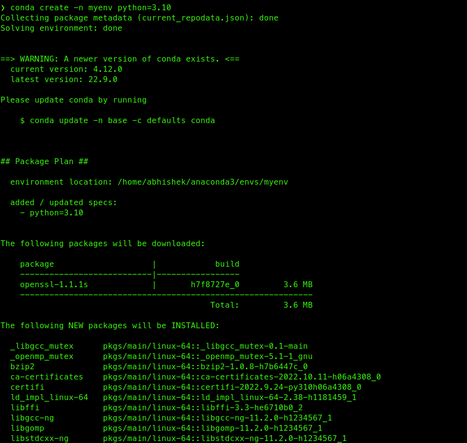
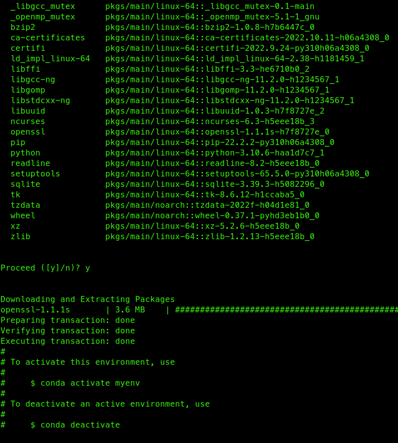

### 2. Install Dependencies
Install all the libraries that is required for the representational learning
```
$> conda activate myenv
$> python -m pip install jupyter notebook numpy pandas nltk gensim seaborn matplotlib scikit-learn
```
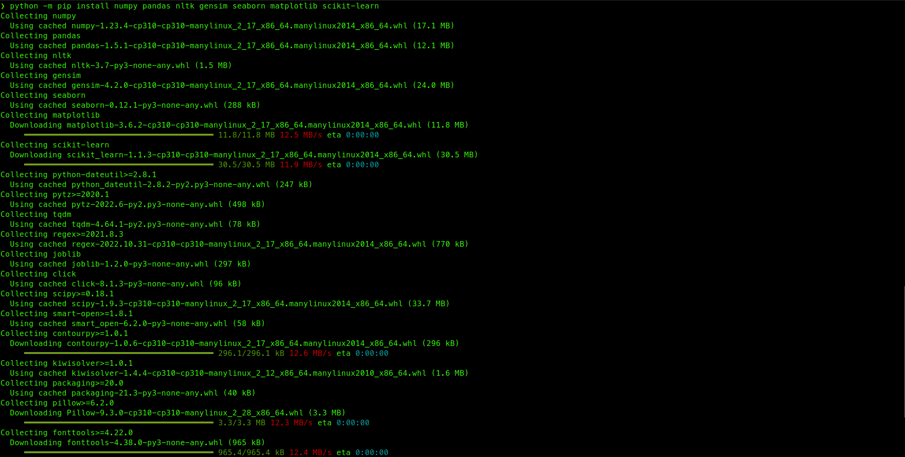
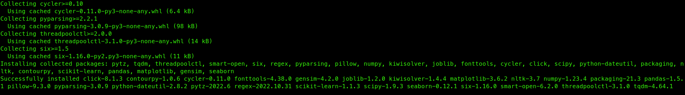

For all our other requirements, we rely on Jupyter notebooks.

## Dataset

I will be performing sentiment analysis on the IMDB review dataset. The dataset is taken from https://www.kaggle.com/datasets/varun08/imdb-dataset. The dataset contains a training set and testing set. The training set is labelled with sentiments.

### Training dataset
The dataset contains 3 columns -
1. `id` - The ID of the review
2. `sentiment` - The sentiment of the review
3. `review` - The text of the review

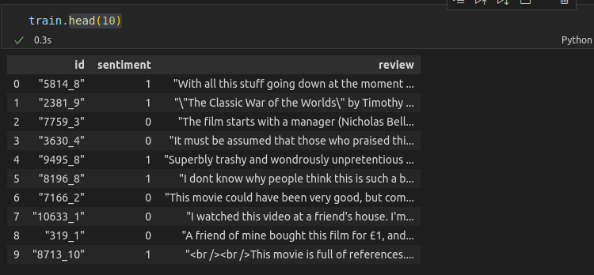

### Testing dataset
The dataset contains 2 columns -
1. `id` - The ID of the review
2. `review` - The text of the review that needs to get assigned a sentiment

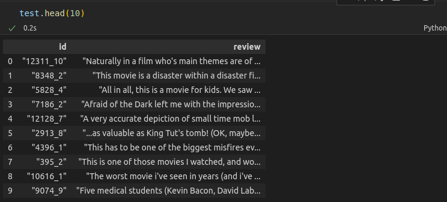

### Sample Review
```
"With all this stuff going down at the moment with MJ i've started listening to his music, watching the odd documentary here and there, watched The Wiz and watched Moonwalker again. Maybe i just want to get a certain insight into this guy who i thought was really cool in the eighties just to maybe make up my mind whether he is guilty or innocent. Moonwalker is part biography, part feature film which i remember going to see at the cinema when it was originally released. Some of it has subtle messages about MJ's feeling towards the press and also the obvious message of drugs are bad m'kay.<br /><br />Visually impressive but of course this is all about Michael Jackson so unless you remotely like MJ in anyway then you are going to hate this and find it boring. Some may call MJ an egotist for consenting to the making of this movie BUT MJ and most of his fans would say that he made it for the fans which if true is really nice of him.<br /><br />The actual feature film bit when it finally starts is only on for 20 minutes or so excluding the Smooth Criminal sequence and Joe Pesci is convincing as a psychopathic all powerful drug lord. Why he wants MJ dead so bad is beyond me. Because MJ overheard his plans? Nah, Joe Pesci's character ranted that he wanted people to know it is he who is supplying drugs etc so i dunno, maybe he just hates MJ's music.<br /><br />Lots of cool things in this like MJ turning into a car and a robot and the whole Speed Demon sequence. Also, the director must have had the patience of a saint when it came to filming the kiddy Bad sequence as usually directors hate working with one kid let alone a whole bunch of them performing a complex dance scene.<br /><br />Bottom line, this movie is for people who like MJ on one level or another (which i think is most people). If not, then stay away. It does try and give off a wholesome message and ironically MJ's bestest buddy in this movie is a girl! Michael Jackson is truly one of the most talented people ever to grace this planet but is he guilty? Well, with all the attention i've gave this subject....hmmm well i don't know because people can be different behind closed doors, i know this for a fact. He is either an extremely nice but stupid guy or one of the most sickest liars. I hope he is not the latter."
```

## Cleaning the data

For the Gensim Word2Vec model, the expected input is in the form of list of list of words, where each list of words constitutes a sentence. In our dataset, each review consists of multiple sentences. Each review is basically a paragraph, which consists of multiple sentences. So, the question becomes how do we convert our data into something that can be used as input to the model trainer?

The solution I have come up is as follows -
1. We first try to deconstruct each review into multiple sentences. For this, I use the **punkt** tokenizer from Natural Language Toolkit python library. This tokenizer is very efficient and accurate in determining the split in different sentences, and converting each paragraph into different sentences.
2. Once I have converted each reviews into a bunch of sentences, I will now perform the following steps to convert each sentence into words -
   1. First, we remove all HTML encoding or tags from reviews. Why, you ask? Simply because all of this data has been taken from different websites. A lot of scraping inadvertently captures some HTML tags. Hence, it is good to be cautious to remove them first.
   2. Next, we remove all non-alphanumeric letters from the sentences, as they don't give us any value in word similarity
   3. Now that we have english words in our sentence, we now convert everything to lowercase for standardization.
3. After all of this, we have now got a list of list of words!

### Cleaning Example
1. Original Data
```
"With all this stuff going down at the moment with MJ i've started listening to his music, watching the odd documentary here and there, watched The Wiz and watched Moonwalker again. Maybe i just want to get a certain insight into this guy who i thought was really cool in the eighties just to maybe make up my mind whether he is guilty or innocent. Moonwalker is part biography, part feature film which i remember going to see at the cinema when it was originally released. Some of it has subtle messages about MJ's feeling towards the press and also the obvious message of drugs are bad m'kay.<br /><br />Visually impressive but of course this is all about Michael Jackson so unless you remotely like MJ in anyway then you are going to hate this and find it boring. Some may call MJ an egotist for consenting to the making of this movie BUT MJ and most of his fans would say that he made it for the fans which if true is really nice of him.<br /><br />The actual feature film bit when it finally starts is only on for 20 minutes or so excluding the Smooth Criminal sequence and Joe Pesci is convincing as a psychopathic all powerful drug lord. Why he wants MJ dead so bad is beyond me. Because MJ overheard his plans? Nah, Joe Pesci's character ranted that he wanted people to know it is he who is supplying drugs etc so i dunno, maybe he just hates MJ's music.<br /><br />Lots of cool things in this like MJ turning into a car and a robot and the whole Speed Demon sequence. Also, the director must have had the patience of a saint when it came to filming the kiddy Bad sequence as usually directors hate working with one kid let alone a whole bunch of them performing a complex dance scene.<br /><br />Bottom line, this movie is for people who like MJ on one level or another (which i think is most people). If not, then stay away. It does try and give off a wholesome message and ironically MJ's bestest buddy in this movie is a girl! Michael Jackson is truly one of the most talented people ever to grace this planet but is he guilty? Well, with all the attention i've gave this subject....hmmm well i don't know because people can be different behind closed doors, i know this for a fact. He is either an extremely nice but stupid guy or one of the most sickest liars. I hope he is not the latter."
```
2. Cleaned Data
```
[['with',
  'all',
  'this',
  'stuff',
  'going',
  'down',
  'at',
  'the',
  'moment',
  'with',
  'mj',
  'i',
  've',
  'started',
  'listening',
  'to',
  'his',
  'music',
  'watching',
  'the',
  'odd',
  'documentary',
  'here',
  'and',
  'there',
  'watched',
  'the',
  'wiz',
  'and',
  'watched',
  'moonwalker',
  'again'],
 ['maybe',
  'i',
  'just',
  'want',
  'to',
  'get',
  'a',
  'certain',
  'insight',
  'into',
  'this',
  'guy',
  'who',
  'i',
  'thought',
  'was',
  'really',
  'cool',
  'in',
  'the',
  'eighties',
  'just',
  'to',
  'maybe',
  'make',
  'up',
  'my',
  'mind',
  'whether',
  'he',
  'is',
  'guilty',
  'or',
  'innocent'],
 ['moonwalker',
  'is',
  'part',
  'biography',
  'part',
  'feature',
  'film',
  'which',
  'i',
  'remember',
  'going',
  'to',
  'see',
  'at',
  'the',
  'cinema',
  'when',
  'it',
  'was',
  'originally',
  'released'],
 ['some',
  'of',
  'it',
  'has',
  'subtle',
  'messages',
  'about',
  'mj',
  's',
  'feeling',
  'towards',
  'the',
  'press',
  'and',
  'also',
  'the',
  'obvious',
  'message',
  'of',
  'drugs',
  'are',
  'bad',
  'm',
  'kay',
  'visually',
  'impressive',
  'but',
  'of',
  'course',
  'this',
  'is',
  'all',
  'about',
  'michael',
  'jackson',
  'so',
  'unless',
  'you',
  'remotely',
  'like',
  'mj',
  'in',
  'anyway',
  'then',
  'you',
  'are',
  'going',
  'to',
  'hate',
  'this',
  'and',
  'find',
  'it',
  'boring'],
 ['some',
  'may',
  'call',
  'mj',
  'an',
  'egotist',
  'for',
  'consenting',
  'to',
  'the',
  'making',
  'of',
  'this',
  'movie',
  'but',
  'mj',
  'and',
  'most',
  'of',
  'his',
  'fans',
  'would',
  'say',
  'that',
  'he',
  'made',
  'it',
  'for',
  'the',
  'fans',
  'which',
  'if',
  'true',
  'is',
  'really',
  'nice',
  'of',
  'him',
  'the',
  'actual',
  'feature',
  'film',
  'bit',
  'when',
  'it',
  'finally',
  'starts',
  'is',
  'only',
  'on',
  'for',
  'minutes',
  'or',
  'so',
  'excluding',
  'the',
  'smooth',
  'criminal',
  'sequence',
  'and',
  'joe',
  'pesci',
  'is',
  'convincing',
  'as',
  'a',
  'psychopathic',
  'all',
  'powerful',
  'drug',
  'lord'],
 ['why', 'he', 'wants', 'mj', 'dead', 'so', 'bad', 'is', 'beyond', 'me'],
 ['because', 'mj', 'overheard', 'his', 'plans'],
 ['nah',
  'joe',
  'pesci',
  's',
  'character',
  'ranted',
  'that',
  'he',
  'wanted',
  'people',
  'to',
  'know',
  'it',
  'is',
  'he',
  'who',
  'is',
  'supplying',
  'drugs',
  'etc',
  'so',
  'i',
  'dunno',
  'maybe',
  'he',
  'just',
  'hates',
  'mj',
  's',
  'music',
  'lots',
  'of',
  'cool',
  'things',
  'in',
  'this',
  'like',
  'mj',
  'turning',
  'into',
  'a',
  'car',
  'and',
  'a',
  'robot',
  'and',
  'the',
  'whole',
  'speed',
  'demon',
  'sequence'],
 ['also',
  'the',
  'director',
  'must',
  'have',
  'had',
  'the',
  'patience',
  'of',
  'a',
  'saint',
  'when',
  'it',
  'came',
  'to',
  'filming',
  'the',
  'kiddy',
  'bad',
  'sequence',
  'as',
  'usually',
  'directors',
  'hate',
  'working',
  'with',
  'one',
  'kid',
  'let',
  'alone',
  'a',
  'whole',
  'bunch',
  'of',
  'them',
  'performing',
  'a',
  'complex',
  'dance',
  'scene',
  'bottom',
  'line',
  'this',
  'movie',
  'is',
  'for',
  'people',
  'who',
  'like',
  'mj',
  'on',
  'one',
  'level',
  'or',
  'another',
  'which',
  'i',
  'think',
  'is',
  'most',
  'people'],
 ['if', 'not', 'then', 'stay', 'away'],
 ['it',
  'does',
  'try',
  'and',
  'give',
  'off',
  'a',
  'wholesome',
  'message',
  'and',
  'ironically',
  'mj',
  's',
  'bestest',
  'buddy',
  'in',
  'this',
  'movie',
  'is',
  'a',
  'girl'],
 ['michael',
  'jackson',
  'is',
  'truly',
  'one',
  'of',
  'the',
  'most',
  'talented',
  'people',
  'ever',
  'to',
  'grace',
  'this',
  'planet',
  'but',
  'is',
  'he',
  'guilty'],
 ['well',
  'with',
  'all',
  'the',
  'attention',
  'i',
  've',
  'gave',
  'this',
  'subject',
  'hmmm',
  'well',
  'i',
  'don',
  't',
  'know',
  'because',
  'people',
  'can',
  'be',
  'different',
  'behind',
  'closed',
  'doors',
  'i',
  'know',
  'this',
  'for',
  'a',
  'fact'],
 ['he',
  'is',
  'either',
  'an',
  'extremely',
  'nice',
  'but',
  'stupid',
  'guy',
  'or',
  'one',
  'of',
  'the',
  'most',
  'sickest',
  'liars'],
 ['i', 'hope', 'he', 'is', 'not', 'the', 'latter'],...]
```
## Training the Word2Vec Model
1. After cleaning the data, I will now train the Word2Vec model on the training data.
2. For Word2Vec model, we have the following hyper-parameters -
   1. Word Vector Dimensionality OR Number of Features for finding similarity between the words.
   2. Minimum Word Count Threshold - Only words having more than this value will be counted towards finding similarity.
   3. Context Size - The amount of datapoints that are taken in a batch operation for the operation.
   4. Downsampling Factor - The threshold for configuring which higher-frequency words are randomly downsampled.

For our analysis, we will create **FOUR** models by tuning the minimum word count threshold and context size.

Here is the datapoints for the hyper-parameters that we have chosen -
1. Word Vector Dimensionality - 300 features
2. Minimum Word Count Threshold - 20 and 40 word count
3. Context Size - 10 and 50 records
4. Downsampling Rate - 10^(-3)

Here are the training logs -
```
2022-11-04 16:55:50,010 : INFO : collecting all words and their counts
2022-11-04 16:55:50,011 : INFO : PROGRESS: at sentence #0, processed 0 words, keeping 0 word types
2022-11-04 16:55:50,039 : INFO : PROGRESS: at sentence #10000, processed 225908 words, keeping 17776 word types
2022-11-04 16:55:50,070 : INFO : PROGRESS: at sentence #20000, processed 452097 words, keeping 24953 word types
2022-11-04 16:55:50,099 : INFO : PROGRESS: at sentence #30000, processed 671983 words, keeping 30044 word types
2022-11-04 16:55:50,130 : INFO : PROGRESS: at sentence #40000, processed 898756 words, keeping 34358 word types
2022-11-04 16:55:50,165 : INFO : PROGRESS: at sentence #50000, processed 1122099 words, keeping 37824 word types
2022-11-04 16:55:50,197 : INFO : PROGRESS: at sentence #60000, processed 1341945 words, keeping 40782 word types
2022-11-04 16:55:50,228 : INFO : PROGRESS: at sentence #70000, processed 1566791 words, keeping 43383 word types
2022-11-04 16:55:50,257 : INFO : PROGRESS: at sentence #80000, processed 1785874 words, keeping 45762 word types
2022-11-04 16:55:50,290 : INFO : PROGRESS: at sentence #90000, processed 2010132 words, keeping 48195 word types
2022-11-04 16:55:50,319 : INFO : PROGRESS: at sentence #100000, processed 2231528 words, keeping 50243 word types
2022-11-04 16:55:50,350 : INFO : PROGRESS: at sentence #110000, processed 2451526 words, keeping 52128 word types
2022-11-04 16:55:50,377 : INFO : PROGRESS: at sentence #120000, processed 2674779 words, keeping 54171 word types
2022-11-04 16:55:50,404 : INFO : PROGRESS: at sentence #130000, processed 2899961 words, keeping 55883 word types
2022-11-04 16:55:50,430 : INFO : PROGRESS: at sentence #140000, processed 3117845 words, keeping 57440 word types
2022-11-04 16:55:50,459 : INFO : PROGRESS: at sentence #150000, processed 3343821 words, keeping 59128 word types
2022-11-04 16:55:50,483 : INFO : PROGRESS: at sentence #160000, processed 3566493 words, keeping 60670 word types
2022-11-04 16:55:50,508 : INFO : PROGRESS: at sentence #170000, processed 3789789 words, keeping 62146 word types
2022-11-04 16:55:50,531 : INFO : PROGRESS: at sentence #180000, processed 4012438 words, keeping 63562 word types
2022-11-04 16:55:50,559 : INFO : PROGRESS: at sentence #190000, processed 4238418 words, keeping 64874 word types
2022-11-04 16:55:50,584 : INFO : PROGRESS: at sentence #200000, processed 4461933 words, keeping 66163 word types
2022-11-04 16:55:50,608 : INFO : PROGRESS: at sentence #210000, processed 4685063 words, keeping 67472 word types
2022-11-04 16:55:50,632 : INFO : PROGRESS: at sentence #220000, processed 4910486 words, keeping 68775 word types
2022-11-04 16:55:50,657 : INFO : PROGRESS: at sentence #230000, processed 5132365 words, keeping 70035 word types
2022-11-04 16:55:50,683 : INFO : PROGRESS: at sentence #240000, processed 5358801 words, keeping 71249 word types
2022-11-04 16:55:50,707 : INFO : PROGRESS: at sentence #250000, processed 5571814 words, keeping 72424 word types
2022-11-04 16:55:50,731 : INFO : PROGRESS: at sentence #260000, processed 5794438 words, keeping 73561 word types
2022-11-04 16:55:50,745 : INFO : collected 74218 word types from a corpus of 5920725 raw words and 265803 sentences
2022-11-04 16:55:50,746 : INFO : Creating a fresh vocabulary
2022-11-04 16:55:50,788 : INFO : Word2Vec lifecycle event {'msg': 'effective_min_count=20 retains 13153 unique words (17.72% of original 74218, drops 61065)', 'datetime': '2022-11-04T16:55:50.788085', 'gensim': '4.2.0', 'python': '3.10.4 (main, Mar 31 2022, 08:41:55) [GCC 7.5.0]', 'platform': 'Linux-5.15.0-52-generic-x86_64-with-glibc2.31', 'event': 'prepare_vocab'}
2022-11-04 16:55:50,788 : INFO : Word2Vec lifecycle event {'msg': 'effective_min_count=20 leaves 5694847 word corpus (96.18% of original 5920725, drops 225878)', 'datetime': '2022-11-04T16:55:50.788753', 'gensim': '4.2.0', 'python': '3.10.4 (main, Mar 31 2022, 08:41:55) [GCC 7.5.0]', 'platform': 'Linux-5.15.0-52-generic-x86_64-with-glibc2.31', 'event': 'prepare_vocab'}
2022-11-04 16:55:50,831 : INFO : deleting the raw counts dictionary of 74218 items
2022-11-04 16:55:50,833 : INFO : sample=0.001 downsamples 49 most-common words
2022-11-04 16:55:50,833 : INFO : Word2Vec lifecycle event {'msg': 'downsampling leaves estimated 4195318.304789323 word corpus (73.7%% of prior 5694847)', 'datetime': '2022-11-04T16:55:50.833531', 'gensim': '4.2.0', 'python': '3.10.4 (main, Mar 31 2022, 08:41:55) [GCC 7.5.0]', 'platform': 'Linux-5.15.0-52-generic-x86_64-with-glibc2.31', 'event': 'prepare_vocab'}
2022-11-04 16:55:50,898 : INFO : estimated required memory for 13153 words and 300 dimensions: 38143700 bytes
2022-11-04 16:55:50,899 : INFO : resetting layer weights
2022-11-04 16:55:50,911 : INFO : Word2Vec lifecycle event {'update': False, 'trim_rule': 'None', 'datetime': '2022-11-04T16:55:50.911336', 'gensim': '4.2.0', 'python': '3.10.4 (main, Mar 31 2022, 08:41:55) [GCC 7.5.0]', 'platform': 'Linux-5.15.0-52-generic-x86_64-with-glibc2.31', 'event': 'build_vocab'}
2022-11-04 16:55:50,912 : INFO : Word2Vec lifecycle event {'msg': 'training model with 16 workers on 13153 vocabulary and 300 features, using sg=0 hs=0 sample=0.001 negative=5 window=10 shrink_windows=True', 'datetime': '2022-11-04T16:55:50.912108', 'gensim': '4.2.0', 'python': '3.10.4 (main, Mar 31 2022, 08:41:55) [GCC 7.5.0]', 'platform': 'Linux-5.15.0-52-generic-x86_64-with-glibc2.31', 'event': 'train'}
2022-11-04 16:55:51,929 : INFO : EPOCH 0 - PROGRESS: at 53.43% examples, 2226450 words/s, in_qsize 29, out_qsize 2
2022-11-04 16:55:52,810 : INFO : EPOCH 0: training on 5920725 raw words (4196437 effective words) took 1.9s, 2222117 effective words/s
2022-11-04 16:55:53,826 : INFO : EPOCH 1 - PROGRESS: at 53.42% examples, 2231554 words/s, in_qsize 29, out_qsize 2
2022-11-04 16:55:54,731 : INFO : EPOCH 1: training on 5920725 raw words (4195314 effective words) took 1.9s, 2195427 effective words/s
2022-11-04 16:55:55,744 : INFO : EPOCH 2 - PROGRESS: at 53.12% examples, 2221020 words/s, in_qsize 29, out_qsize 2
2022-11-04 16:55:56,625 : INFO : EPOCH 2: training on 5920725 raw words (4195927 effective words) took 1.9s, 2226545 effective words/s
2022-11-04 16:55:57,635 : INFO : EPOCH 3 - PROGRESS: at 53.27% examples, 2235405 words/s, in_qsize 29, out_qsize 2
2022-11-04 16:55:58,544 : INFO : EPOCH 3: training on 5920725 raw words (4195290 effective words) took 1.9s, 2198298 effective words/s
2022-11-04 16:55:59,554 : INFO : EPOCH 4 - PROGRESS: at 53.27% examples, 2236247 words/s, in_qsize 31, out_qsize 0
2022-11-04 16:56:00,480 : INFO : EPOCH 4: training on 5920725 raw words (4195392 effective words) took 1.9s, 2178932 effective words/s
2022-11-04 16:56:00,481 : INFO : Word2Vec lifecycle event {'msg': 'training on 29603625 raw words (20978360 effective words) took 9.6s, 2192424 effective words/s', 'datetime': '2022-11-04T16:56:00.480977', 'gensim': '4.2.0', 'python': '3.10.4 (main, Mar 31 2022, 08:41:55) [GCC 7.5.0]', 'platform': 'Linux-5.15.0-52-generic-x86_64-with-glibc2.31', 'event': 'train'}
2022-11-04 16:56:00,481 : INFO : Word2Vec lifecycle event {'params': 'Word2Vec<vocab=13153, vector_size=300, alpha=0.025>', 'datetime': '2022-11-04T16:56:00.481436', 'gensim': '4.2.0', 'python': '3.10.4 (main, Mar 31 2022, 08:41:55) [GCC 7.5.0]', 'platform': 'Linux-5.15.0-52-generic-x86_64-with-glibc2.31', 'event': 'created'}
/tmp/ipykernel_6123/1581448484.py:11: DeprecationWarning: Call to deprecated `init_sims` (Gensim 4.0.0 implemented internal optimizations that make calls to init_sims() unnecessary. init_sims() is now obsoleted and will be completely removed in future versions. See https://github.com/RaRe-Technologies/gensim/wiki/Migrating-from-Gensim-3.x-to-4).
  model.init_sims(replace=True)
2022-11-04 16:56:00,485 : WARNING : destructive init_sims(replace=True) deprecated & no longer required for space-efficiency
2022-11-04 16:56:00,487 : INFO : Word2Vec lifecycle event {'fname_or_handle': '300features_20minwords_10context', 'separately': 'None', 'sep_limit': 10485760, 'ignore': frozenset(), 'datetime': '2022-11-04T16:56:00.487837', 'gensim': '4.2.0', 'python': '3.10.4 (main, Mar 31 2022, 08:41:55) [GCC 7.5.0]', 'platform': 'Linux-5.15.0-52-generic-x86_64-with-glibc2.31', 'event': 'saving'}
2022-11-04 16:56:00,488 : INFO : not storing attribute cum_table
2022-11-04 16:56:00,509 : INFO : saved 300features_20minwords_10context
```
```
2022-11-04 16:56:00,510 : INFO : collecting all words and their counts
2022-11-04 16:56:00,510 : INFO : PROGRESS: at sentence #0, processed 0 words, keeping 0 word types
2022-11-04 16:56:00,537 : INFO : PROGRESS: at sentence #10000, processed 225908 words, keeping 17776 word types
2022-11-04 16:56:00,566 : INFO : PROGRESS: at sentence #20000, processed 452097 words, keeping 24953 word types
2022-11-04 16:56:00,595 : INFO : PROGRESS: at sentence #30000, processed 671983 words, keeping 30044 word types
2022-11-04 16:56:00,626 : INFO : PROGRESS: at sentence #40000, processed 898756 words, keeping 34358 word types
2022-11-04 16:56:00,656 : INFO : PROGRESS: at sentence #50000, processed 1122099 words, keeping 37824 word types
2022-11-04 16:56:00,684 : INFO : PROGRESS: at sentence #60000, processed 1341945 words, keeping 40782 word types
2022-11-04 16:56:00,714 : INFO : PROGRESS: at sentence #70000, processed 1566791 words, keeping 43383 word types
2022-11-04 16:56:00,744 : INFO : PROGRESS: at sentence #80000, processed 1785874 words, keeping 45762 word types
2022-11-04 16:56:00,773 : INFO : PROGRESS: at sentence #90000, processed 2010132 words, keeping 48195 word types
2022-11-04 16:56:00,802 : INFO : PROGRESS: at sentence #100000, processed 2231528 words, keeping 50243 word types
2022-11-04 16:56:00,831 : INFO : PROGRESS: at sentence #110000, processed 2451526 words, keeping 52128 word types
2022-11-04 16:56:00,855 : INFO : PROGRESS: at sentence #120000, processed 2674779 words, keeping 54171 word types
2022-11-04 16:56:00,879 : INFO : PROGRESS: at sentence #130000, processed 2899961 words, keeping 55883 word types
2022-11-04 16:56:00,903 : INFO : PROGRESS: at sentence #140000, processed 3117845 words, keeping 57440 word types
2022-11-04 16:56:00,927 : INFO : PROGRESS: at sentence #150000, processed 3343821 words, keeping 59128 word types
2022-11-04 16:56:00,950 : INFO : PROGRESS: at sentence #160000, processed 3566493 words, keeping 60670 word types
2022-11-04 16:56:00,973 : INFO : PROGRESS: at sentence #170000, processed 3789789 words, keeping 62146 word types
2022-11-04 16:56:00,996 : INFO : PROGRESS: at sentence #180000, processed 4012438 words, keeping 63562 word types
2022-11-04 16:56:01,021 : INFO : PROGRESS: at sentence #190000, processed 4238418 words, keeping 64874 word types
2022-11-04 16:56:01,044 : INFO : PROGRESS: at sentence #200000, processed 4461933 words, keeping 66163 word types
2022-11-04 16:56:01,069 : INFO : PROGRESS: at sentence #210000, processed 4685063 words, keeping 67472 word types
2022-11-04 16:56:01,092 : INFO : PROGRESS: at sentence #220000, processed 4910486 words, keeping 68775 word types
2022-11-04 16:56:01,115 : INFO : PROGRESS: at sentence #230000, processed 5132365 words, keeping 70035 word types
2022-11-04 16:56:01,139 : INFO : PROGRESS: at sentence #240000, processed 5358801 words, keeping 71249 word types
2022-11-04 16:56:01,162 : INFO : PROGRESS: at sentence #250000, processed 5571814 words, keeping 72424 word types
2022-11-04 16:56:01,187 : INFO : PROGRESS: at sentence #260000, processed 5794438 words, keeping 73561 word types
2022-11-04 16:56:01,201 : INFO : collected 74218 word types from a corpus of 5920725 raw words and 265803 sentences
2022-11-04 16:56:01,202 : INFO : Creating a fresh vocabulary
2022-11-04 16:56:01,244 : INFO : Word2Vec lifecycle event {'msg': 'effective_min_count=20 retains 13153 unique words (17.72% of original 74218, drops 61065)', 'datetime': '2022-11-04T16:56:01.244048', 'gensim': '4.2.0', 'python': '3.10.4 (main, Mar 31 2022, 08:41:55) [GCC 7.5.0]', 'platform': 'Linux-5.15.0-52-generic-x86_64-with-glibc2.31', 'event': 'prepare_vocab'}
2022-11-04 16:56:01,244 : INFO : Word2Vec lifecycle event {'msg': 'effective_min_count=20 leaves 5694847 word corpus (96.18% of original 5920725, drops 225878)', 'datetime': '2022-11-04T16:56:01.244626', 'gensim': '4.2.0', 'python': '3.10.4 (main, Mar 31 2022, 08:41:55) [GCC 7.5.0]', 'platform': 'Linux-5.15.0-52-generic-x86_64-with-glibc2.31', 'event': 'prepare_vocab'}
2022-11-04 16:56:01,297 : INFO : deleting the raw counts dictionary of 74218 items
2022-11-04 16:56:01,299 : INFO : sample=0.001 downsamples 49 most-common words
2022-11-04 16:56:01,299 : INFO : Word2Vec lifecycle event {'msg': 'downsampling leaves estimated 4195318.304789323 word corpus (73.7%% of prior 5694847)', 'datetime': '2022-11-04T16:56:01.299524', 'gensim': '4.2.0', 'python': '3.10.4 (main, Mar 31 2022, 08:41:55) [GCC 7.5.0]', 'platform': 'Linux-5.15.0-52-generic-x86_64-with-glibc2.31', 'event': 'prepare_vocab'}
2022-11-04 16:56:01,377 : INFO : estimated required memory for 13153 words and 300 dimensions: 38143700 bytes
2022-11-04 16:56:01,377 : INFO : resetting layer weights
2022-11-04 16:56:01,389 : INFO : Word2Vec lifecycle event {'update': False, 'trim_rule': 'None', 'datetime': '2022-11-04T16:56:01.389815', 'gensim': '4.2.0', 'python': '3.10.4 (main, Mar 31 2022, 08:41:55) [GCC 7.5.0]', 'platform': 'Linux-5.15.0-52-generic-x86_64-with-glibc2.31', 'event': 'build_vocab'}
2022-11-04 16:56:01,390 : INFO : Word2Vec lifecycle event {'msg': 'training model with 16 workers on 13153 vocabulary and 300 features, using sg=0 hs=0 sample=0.001 negative=5 window=50 shrink_windows=True', 'datetime': '2022-11-04T16:56:01.390725', 'gensim': '4.2.0', 'python': '3.10.4 (main, Mar 31 2022, 08:41:55) [GCC 7.5.0]', 'platform': 'Linux-5.15.0-52-generic-x86_64-with-glibc2.31', 'event': 'train'}
2022-11-04 16:56:02,403 : INFO : EPOCH 0 - PROGRESS: at 49.39% examples, 2068238 words/s, in_qsize 29, out_qsize 2
2022-11-04 16:56:03,407 : INFO : EPOCH 0 - PROGRESS: at 97.74% examples, 2044754 words/s, in_qsize 14, out_qsize 1
2022-11-04 16:56:03,433 : INFO : EPOCH 0: training on 5920725 raw words (4196693 effective words) took 2.0s, 2064485 effective words/s
2022-11-04 16:56:04,444 : INFO : EPOCH 1 - PROGRESS: at 49.89% examples, 2093206 words/s, in_qsize 31, out_qsize 0
2022-11-04 16:56:05,445 : INFO : EPOCH 1 - PROGRESS: at 98.08% examples, 2056309 words/s, in_qsize 12, out_qsize 1
2022-11-04 16:56:05,471 : INFO : EPOCH 1: training on 5920725 raw words (4195760 effective words) took 2.0s, 2069473 effective words/s
2022-11-04 16:56:06,485 : INFO : EPOCH 2 - PROGRESS: at 49.73% examples, 2078372 words/s, in_qsize 31, out_qsize 0
2022-11-04 16:56:07,491 : INFO : EPOCH 2 - PROGRESS: at 97.20% examples, 2029994 words/s, in_qsize 16, out_qsize 1
2022-11-04 16:56:07,528 : INFO : EPOCH 2: training on 5920725 raw words (4195675 effective words) took 2.0s, 2049154 effective words/s
2022-11-04 16:56:08,542 : INFO : EPOCH 3 - PROGRESS: at 45.17% examples, 1891041 words/s, in_qsize 31, out_qsize 0
2022-11-04 16:56:09,544 : INFO : EPOCH 3 - PROGRESS: at 93.12% examples, 1951172 words/s, in_qsize 31, out_qsize 0
2022-11-04 16:56:09,652 : INFO : EPOCH 3: training on 5920725 raw words (4195149 effective words) took 2.1s, 1985594 effective words/s
2022-11-04 16:56:10,665 : INFO : EPOCH 4 - PROGRESS: at 49.73% examples, 2079846 words/s, in_qsize 31, out_qsize 0
2022-11-04 16:56:11,668 : INFO : EPOCH 4 - PROGRESS: at 96.21% examples, 2012985 words/s, in_qsize 23, out_qsize 0
2022-11-04 16:56:11,729 : INFO : EPOCH 4: training on 5920725 raw words (4195038 effective words) took 2.1s, 2029420 effective words/s
2022-11-04 16:56:11,729 : INFO : Word2Vec lifecycle event {'msg': 'training on 29603625 raw words (20978315 effective words) took 10.3s, 2029108 effective words/s', 'datetime': '2022-11-04T16:56:11.729816', 'gensim': '4.2.0', 'python': '3.10.4 (main, Mar 31 2022, 08:41:55) [GCC 7.5.0]', 'platform': 'Linux-5.15.0-52-generic-x86_64-with-glibc2.31', 'event': 'train'}
2022-11-04 16:56:11,730 : INFO : Word2Vec lifecycle event {'params': 'Word2Vec<vocab=13153, vector_size=300, alpha=0.025>', 'datetime': '2022-11-04T16:56:11.730193', 'gensim': '4.2.0', 'python': '3.10.4 (main, Mar 31 2022, 08:41:55) [GCC 7.5.0]', 'platform': 'Linux-5.15.0-52-generic-x86_64-with-glibc2.31', 'event': 'created'}
/tmp/ipykernel_6123/1581448484.py:11: DeprecationWarning: Call to deprecated `init_sims` (Gensim 4.0.0 implemented internal optimizations that make calls to init_sims() unnecessary. init_sims() is now obsoleted and will be completely removed in future versions. See https://github.com/RaRe-Technologies/gensim/wiki/Migrating-from-Gensim-3.x-to-4).
  model.init_sims(replace=True)
2022-11-04 16:56:11,734 : WARNING : destructive init_sims(replace=True) deprecated & no longer required for space-efficiency
2022-11-04 16:56:11,737 : INFO : Word2Vec lifecycle event {'fname_or_handle': '300features_20minwords_50context', 'separately': 'None', 'sep_limit': 10485760, 'ignore': frozenset(), 'datetime': '2022-11-04T16:56:11.737022', 'gensim': '4.2.0', 'python': '3.10.4 (main, Mar 31 2022, 08:41:55) [GCC 7.5.0]', 'platform': 'Linux-5.15.0-52-generic-x86_64-with-glibc2.31', 'event': 'saving'}
2022-11-04 16:56:11,737 : INFO : not storing attribute cum_table
2022-11-04 16:56:11,757 : INFO : saved 300features_20minwords_50context
```
```
2022-11-04 16:56:11,758 : INFO : collecting all words and their counts
2022-11-04 16:56:11,758 : INFO : PROGRESS: at sentence #0, processed 0 words, keeping 0 word types
2022-11-04 16:56:11,786 : INFO : PROGRESS: at sentence #10000, processed 225908 words, keeping 17776 word types
2022-11-04 16:56:11,815 : INFO : PROGRESS: at sentence #20000, processed 452097 words, keeping 24953 word types
2022-11-04 16:56:11,846 : INFO : PROGRESS: at sentence #30000, processed 671983 words, keeping 30044 word types
2022-11-04 16:56:11,878 : INFO : PROGRESS: at sentence #40000, processed 898756 words, keeping 34358 word types
2022-11-04 16:56:11,908 : INFO : PROGRESS: at sentence #50000, processed 1122099 words, keeping 37824 word types
2022-11-04 16:56:11,937 : INFO : PROGRESS: at sentence #60000, processed 1341945 words, keeping 40782 word types
2022-11-04 16:56:11,967 : INFO : PROGRESS: at sentence #70000, processed 1566791 words, keeping 43383 word types
2022-11-04 16:56:11,995 : INFO : PROGRESS: at sentence #80000, processed 1785874 words, keeping 45762 word types
2022-11-04 16:56:12,023 : INFO : PROGRESS: at sentence #90000, processed 2010132 words, keeping 48195 word types
2022-11-04 16:56:12,053 : INFO : PROGRESS: at sentence #100000, processed 2231528 words, keeping 50243 word types
2022-11-04 16:56:12,082 : INFO : PROGRESS: at sentence #110000, processed 2451526 words, keeping 52128 word types
2022-11-04 16:56:12,105 : INFO : PROGRESS: at sentence #120000, processed 2674779 words, keeping 54171 word types
2022-11-04 16:56:12,129 : INFO : PROGRESS: at sentence #130000, processed 2899961 words, keeping 55883 word types
2022-11-04 16:56:12,154 : INFO : PROGRESS: at sentence #140000, processed 3117845 words, keeping 57440 word types
2022-11-04 16:56:12,181 : INFO : PROGRESS: at sentence #150000, processed 3343821 words, keeping 59128 word types
2022-11-04 16:56:12,209 : INFO : PROGRESS: at sentence #160000, processed 3566493 words, keeping 60670 word types
2022-11-04 16:56:12,235 : INFO : PROGRESS: at sentence #170000, processed 3789789 words, keeping 62146 word types
2022-11-04 16:56:12,260 : INFO : PROGRESS: at sentence #180000, processed 4012438 words, keeping 63562 word types
2022-11-04 16:56:12,289 : INFO : PROGRESS: at sentence #190000, processed 4238418 words, keeping 64874 word types
2022-11-04 16:56:12,314 : INFO : PROGRESS: at sentence #200000, processed 4461933 words, keeping 66163 word types
2022-11-04 16:56:12,339 : INFO : PROGRESS: at sentence #210000, processed 4685063 words, keeping 67472 word types
2022-11-04 16:56:12,365 : INFO : PROGRESS: at sentence #220000, processed 4910486 words, keeping 68775 word types
2022-11-04 16:56:12,395 : INFO : PROGRESS: at sentence #230000, processed 5132365 words, keeping 70035 word types
2022-11-04 16:56:12,423 : INFO : PROGRESS: at sentence #240000, processed 5358801 words, keeping 71249 word types
2022-11-04 16:56:12,447 : INFO : PROGRESS: at sentence #250000, processed 5571814 words, keeping 72424 word types
2022-11-04 16:56:12,472 : INFO : PROGRESS: at sentence #260000, processed 5794438 words, keeping 73561 word types
2022-11-04 16:56:12,487 : INFO : collected 74218 word types from a corpus of 5920725 raw words and 265803 sentences
2022-11-04 16:56:12,487 : INFO : Creating a fresh vocabulary
2022-11-04 16:56:12,522 : INFO : Word2Vec lifecycle event {'msg': 'effective_min_count=40 retains 8306 unique words (11.19% of original 74218, drops 65912)', 'datetime': '2022-11-04T16:56:12.522281', 'gensim': '4.2.0', 'python': '3.10.4 (main, Mar 31 2022, 08:41:55) [GCC 7.5.0]', 'platform': 'Linux-5.15.0-52-generic-x86_64-with-glibc2.31', 'event': 'prepare_vocab'}
2022-11-04 16:56:12,522 : INFO : Word2Vec lifecycle event {'msg': 'effective_min_count=40 leaves 5559777 word corpus (93.90% of original 5920725, drops 360948)', 'datetime': '2022-11-04T16:56:12.522822', 'gensim': '4.2.0', 'python': '3.10.4 (main, Mar 31 2022, 08:41:55) [GCC 7.5.0]', 'platform': 'Linux-5.15.0-52-generic-x86_64-with-glibc2.31', 'event': 'prepare_vocab'}
2022-11-04 16:56:12,549 : INFO : deleting the raw counts dictionary of 74218 items
2022-11-04 16:56:12,551 : INFO : sample=0.001 downsamples 50 most-common words
2022-11-04 16:56:12,551 : INFO : Word2Vec lifecycle event {'msg': 'downsampling leaves estimated 4044394.7529395744 word corpus (72.7%% of prior 5559777)', 'datetime': '2022-11-04T16:56:12.551752', 'gensim': '4.2.0', 'python': '3.10.4 (main, Mar 31 2022, 08:41:55) [GCC 7.5.0]', 'platform': 'Linux-5.15.0-52-generic-x86_64-with-glibc2.31', 'event': 'prepare_vocab'}
2022-11-04 16:56:12,593 : INFO : estimated required memory for 8306 words and 300 dimensions: 24087400 bytes
2022-11-04 16:56:12,594 : INFO : resetting layer weights
2022-11-04 16:56:12,601 : INFO : Word2Vec lifecycle event {'update': False, 'trim_rule': 'None', 'datetime': '2022-11-04T16:56:12.601633', 'gensim': '4.2.0', 'python': '3.10.4 (main, Mar 31 2022, 08:41:55) [GCC 7.5.0]', 'platform': 'Linux-5.15.0-52-generic-x86_64-with-glibc2.31', 'event': 'build_vocab'}
2022-11-04 16:56:12,602 : INFO : Word2Vec lifecycle event {'msg': 'training model with 16 workers on 8306 vocabulary and 300 features, using sg=0 hs=0 sample=0.001 negative=5 window=10 shrink_windows=True', 'datetime': '2022-11-04T16:56:12.602299', 'gensim': '4.2.0', 'python': '3.10.4 (main, Mar 31 2022, 08:41:55) [GCC 7.5.0]', 'platform': 'Linux-5.15.0-52-generic-x86_64-with-glibc2.31', 'event': 'train'}
2022-11-04 16:56:13,612 : INFO : EPOCH 0 - PROGRESS: at 59.85% examples, 2417974 words/s, in_qsize 28, out_qsize 3
2022-11-04 16:56:14,288 : INFO : EPOCH 0: training on 5920725 raw words (4044389 effective words) took 1.7s, 2412220 effective words/s
2022-11-04 16:56:15,299 : INFO : EPOCH 1 - PROGRESS: at 58.80% examples, 2374758 words/s, in_qsize 29, out_qsize 2
2022-11-04 16:56:16,006 : INFO : EPOCH 1: training on 5920725 raw words (4043543 effective words) took 1.7s, 2366713 effective words/s
2022-11-04 16:56:17,026 : INFO : EPOCH 2 - PROGRESS: at 59.33% examples, 2376614 words/s, in_qsize 28, out_qsize 3
2022-11-04 16:56:17,715 : INFO : EPOCH 2: training on 5920725 raw words (4043701 effective words) took 1.7s, 2379987 effective words/s
2022-11-04 16:56:18,729 : INFO : EPOCH 3 - PROGRESS: at 60.84% examples, 2451353 words/s, in_qsize 29, out_qsize 2
2022-11-04 16:56:19,413 : INFO : EPOCH 3: training on 5920725 raw words (4044120 effective words) took 1.7s, 2396651 effective words/s
2022-11-04 16:56:20,426 : INFO : EPOCH 4 - PROGRESS: at 60.00% examples, 2420903 words/s, in_qsize 31, out_qsize 0
2022-11-04 16:56:21,125 : INFO : EPOCH 4: training on 5920725 raw words (4044751 effective words) took 1.7s, 2376302 effective words/s
2022-11-04 16:56:21,126 : INFO : Word2Vec lifecycle event {'msg': 'training on 29603625 raw words (20220504 effective words) took 8.5s, 2372310 effective words/s', 'datetime': '2022-11-04T16:56:21.126164', 'gensim': '4.2.0', 'python': '3.10.4 (main, Mar 31 2022, 08:41:55) [GCC 7.5.0]', 'platform': 'Linux-5.15.0-52-generic-x86_64-with-glibc2.31', 'event': 'train'}
2022-11-04 16:56:21,126 : INFO : Word2Vec lifecycle event {'params': 'Word2Vec<vocab=8306, vector_size=300, alpha=0.025>', 'datetime': '2022-11-04T16:56:21.126738', 'gensim': '4.2.0', 'python': '3.10.4 (main, Mar 31 2022, 08:41:55) [GCC 7.5.0]', 'platform': 'Linux-5.15.0-52-generic-x86_64-with-glibc2.31', 'event': 'created'}
/tmp/ipykernel_6123/1581448484.py:11: DeprecationWarning: Call to deprecated `init_sims` (Gensim 4.0.0 implemented internal optimizations that make calls to init_sims() unnecessary. init_sims() is now obsoleted and will be completely removed in future versions. See https://github.com/RaRe-Technologies/gensim/wiki/Migrating-from-Gensim-3.x-to-4).
  model.init_sims(replace=True)
2022-11-04 16:56:21,129 : WARNING : destructive init_sims(replace=True) deprecated & no longer required for space-efficiency
2022-11-04 16:56:21,131 : INFO : Word2Vec lifecycle event {'fname_or_handle': '300features_40minwords_10context', 'separately': 'None', 'sep_limit': 10485760, 'ignore': frozenset(), 'datetime': '2022-11-04T16:56:21.131470', 'gensim': '4.2.0', 'python': '3.10.4 (main, Mar 31 2022, 08:41:55) [GCC 7.5.0]', 'platform': 'Linux-5.15.0-52-generic-x86_64-with-glibc2.31', 'event': 'saving'}
2022-11-04 16:56:21,132 : INFO : not storing attribute cum_table
2022-11-04 16:56:21,146 : INFO : saved 300features_40minwords_10context
```
```
2022-11-04 16:56:21,146 : INFO : collecting all words and their counts
2022-11-04 16:56:21,147 : INFO : PROGRESS: at sentence #0, processed 0 words, keeping 0 word types
2022-11-04 16:56:21,175 : INFO : PROGRESS: at sentence #10000, processed 225908 words, keeping 17776 word types
2022-11-04 16:56:21,204 : INFO : PROGRESS: at sentence #20000, processed 452097 words, keeping 24953 word types
2022-11-04 16:56:21,232 : INFO : PROGRESS: at sentence #30000, processed 671983 words, keeping 30044 word types
2022-11-04 16:56:21,263 : INFO : PROGRESS: at sentence #40000, processed 898756 words, keeping 34358 word types
2022-11-04 16:56:21,292 : INFO : PROGRESS: at sentence #50000, processed 1122099 words, keeping 37824 word types
2022-11-04 16:56:21,321 : INFO : PROGRESS: at sentence #60000, processed 1341945 words, keeping 40782 word types
2022-11-04 16:56:21,352 : INFO : PROGRESS: at sentence #70000, processed 1566791 words, keeping 43383 word types
2022-11-04 16:56:21,380 : INFO : PROGRESS: at sentence #80000, processed 1785874 words, keeping 45762 word types
2022-11-04 16:56:21,410 : INFO : PROGRESS: at sentence #90000, processed 2010132 words, keeping 48195 word types
2022-11-04 16:56:21,439 : INFO : PROGRESS: at sentence #100000, processed 2231528 words, keeping 50243 word types
2022-11-04 16:56:21,468 : INFO : PROGRESS: at sentence #110000, processed 2451526 words, keeping 52128 word types
2022-11-04 16:56:21,491 : INFO : PROGRESS: at sentence #120000, processed 2674779 words, keeping 54171 word types
2022-11-04 16:56:21,515 : INFO : PROGRESS: at sentence #130000, processed 2899961 words, keeping 55883 word types
2022-11-04 16:56:21,539 : INFO : PROGRESS: at sentence #140000, processed 3117845 words, keeping 57440 word types
2022-11-04 16:56:21,563 : INFO : PROGRESS: at sentence #150000, processed 3343821 words, keeping 59128 word types
2022-11-04 16:56:21,587 : INFO : PROGRESS: at sentence #160000, processed 3566493 words, keeping 60670 word types
2022-11-04 16:56:21,611 : INFO : PROGRESS: at sentence #170000, processed 3789789 words, keeping 62146 word types
2022-11-04 16:56:21,635 : INFO : PROGRESS: at sentence #180000, processed 4012438 words, keeping 63562 word types
2022-11-04 16:56:21,659 : INFO : PROGRESS: at sentence #190000, processed 4238418 words, keeping 64874 word types
2022-11-04 16:56:21,683 : INFO : PROGRESS: at sentence #200000, processed 4461933 words, keeping 66163 word types
2022-11-04 16:56:21,707 : INFO : PROGRESS: at sentence #210000, processed 4685063 words, keeping 67472 word types
2022-11-04 16:56:21,730 : INFO : PROGRESS: at sentence #220000, processed 4910486 words, keeping 68775 word types
2022-11-04 16:56:21,754 : INFO : PROGRESS: at sentence #230000, processed 5132365 words, keeping 70035 word types
2022-11-04 16:56:21,779 : INFO : PROGRESS: at sentence #240000, processed 5358801 words, keeping 71249 word types
2022-11-04 16:56:21,802 : INFO : PROGRESS: at sentence #250000, processed 5571814 words, keeping 72424 word types
2022-11-04 16:56:21,826 : INFO : PROGRESS: at sentence #260000, processed 5794438 words, keeping 73561 word types
2022-11-04 16:56:21,843 : INFO : collected 74218 word types from a corpus of 5920725 raw words and 265803 sentences
2022-11-04 16:56:21,843 : INFO : Creating a fresh vocabulary
2022-11-04 16:56:21,877 : INFO : Word2Vec lifecycle event {'msg': 'effective_min_count=40 retains 8306 unique words (11.19% of original 74218, drops 65912)', 'datetime': '2022-11-04T16:56:21.877153', 'gensim': '4.2.0', 'python': '3.10.4 (main, Mar 31 2022, 08:41:55) [GCC 7.5.0]', 'platform': 'Linux-5.15.0-52-generic-x86_64-with-glibc2.31', 'event': 'prepare_vocab'}
2022-11-04 16:56:21,877 : INFO : Word2Vec lifecycle event {'msg': 'effective_min_count=40 leaves 5559777 word corpus (93.90% of original 5920725, drops 360948)', 'datetime': '2022-11-04T16:56:21.877730', 'gensim': '4.2.0', 'python': '3.10.4 (main, Mar 31 2022, 08:41:55) [GCC 7.5.0]', 'platform': 'Linux-5.15.0-52-generic-x86_64-with-glibc2.31', 'event': 'prepare_vocab'}
2022-11-04 16:56:21,905 : INFO : deleting the raw counts dictionary of 74218 items
2022-11-04 16:56:21,906 : INFO : sample=0.001 downsamples 50 most-common words
2022-11-04 16:56:21,907 : INFO : Word2Vec lifecycle event {'msg': 'downsampling leaves estimated 4044394.7529395744 word corpus (72.7%% of prior 5559777)', 'datetime': '2022-11-04T16:56:21.907357', 'gensim': '4.2.0', 'python': '3.10.4 (main, Mar 31 2022, 08:41:55) [GCC 7.5.0]', 'platform': 'Linux-5.15.0-52-generic-x86_64-with-glibc2.31', 'event': 'prepare_vocab'}
2022-11-04 16:56:21,949 : INFO : estimated required memory for 8306 words and 300 dimensions: 24087400 bytes
2022-11-04 16:56:21,950 : INFO : resetting layer weights
2022-11-04 16:56:21,956 : INFO : Word2Vec lifecycle event {'update': False, 'trim_rule': 'None', 'datetime': '2022-11-04T16:56:21.956716', 'gensim': '4.2.0', 'python': '3.10.4 (main, Mar 31 2022, 08:41:55) [GCC 7.5.0]', 'platform': 'Linux-5.15.0-52-generic-x86_64-with-glibc2.31', 'event': 'build_vocab'}
2022-11-04 16:56:21,957 : INFO : Word2Vec lifecycle event {'msg': 'training model with 16 workers on 8306 vocabulary and 300 features, using sg=0 hs=0 sample=0.001 negative=5 window=50 shrink_windows=True', 'datetime': '2022-11-04T16:56:21.957384', 'gensim': '4.2.0', 'python': '3.10.4 (main, Mar 31 2022, 08:41:55) [GCC 7.5.0]', 'platform': 'Linux-5.15.0-52-generic-x86_64-with-glibc2.31', 'event': 'train'}
2022-11-04 16:56:22,972 : INFO : EPOCH 0 - PROGRESS: at 54.62% examples, 2191473 words/s, in_qsize 31, out_qsize 0
2022-11-04 16:56:23,848 : INFO : EPOCH 0: training on 5920725 raw words (4043324 effective words) took 1.9s, 2147201 effective words/s
2022-11-04 16:56:24,859 : INFO : EPOCH 1 - PROGRESS: at 53.93% examples, 2180633 words/s, in_qsize 29, out_qsize 2
2022-11-04 16:56:25,742 : INFO : EPOCH 1: training on 5920725 raw words (4044981 effective words) took 1.9s, 2147143 effective words/s
2022-11-04 16:56:26,761 : INFO : EPOCH 2 - PROGRESS: at 53.77% examples, 2155445 words/s, in_qsize 29, out_qsize 2
2022-11-04 16:56:27,643 : INFO : EPOCH 2: training on 5920725 raw words (4044558 effective words) took 1.9s, 2138563 effective words/s
2022-11-04 16:56:28,653 : INFO : EPOCH 3 - PROGRESS: at 53.77% examples, 2175267 words/s, in_qsize 31, out_qsize 0
2022-11-04 16:56:29,539 : INFO : EPOCH 3: training on 5920725 raw words (4044955 effective words) took 1.9s, 2145222 effective words/s
2022-11-04 16:56:30,550 : INFO : EPOCH 4 - PROGRESS: at 53.60% examples, 2165880 words/s, in_qsize 31, out_qsize 0
2022-11-04 16:56:31,453 : INFO : EPOCH 4: training on 5920725 raw words (4044291 effective words) took 1.9s, 2123836 effective words/s
2022-11-04 16:56:31,454 : INFO : Word2Vec lifecycle event {'msg': 'training on 29603625 raw words (20222109 effective words) took 9.5s, 2129377 effective words/s', 'datetime': '2022-11-04T16:56:31.454476', 'gensim': '4.2.0', 'python': '3.10.4 (main, Mar 31 2022, 08:41:55) [GCC 7.5.0]', 'platform': 'Linux-5.15.0-52-generic-x86_64-with-glibc2.31', 'event': 'train'}
2022-11-04 16:56:31,454 : INFO : Word2Vec lifecycle event {'params': 'Word2Vec<vocab=8306, vector_size=300, alpha=0.025>', 'datetime': '2022-11-04T16:56:31.454937', 'gensim': '4.2.0', 'python': '3.10.4 (main, Mar 31 2022, 08:41:55) [GCC 7.5.0]', 'platform': 'Linux-5.15.0-52-generic-x86_64-with-glibc2.31', 'event': 'created'}
/tmp/ipykernel_6123/1581448484.py:11: DeprecationWarning: Call to deprecated `init_sims` (Gensim 4.0.0 implemented internal optimizations that make calls to init_sims() unnecessary. init_sims() is now obsoleted and will be completely removed in future versions. See https://github.com/RaRe-Technologies/gensim/wiki/Migrating-from-Gensim-3.x-to-4).
  model.init_sims(replace=True)
2022-11-04 16:56:31,457 : WARNING : destructive init_sims(replace=True) deprecated & no longer required for space-efficiency
2022-11-04 16:56:31,458 : INFO : Word2Vec lifecycle event {'fname_or_handle': '300features_40minwords_50context', 'separately': 'None', 'sep_limit': 10485760, 'ignore': frozenset(), 'datetime': '2022-11-04T16:56:31.458792', 'gensim': '4.2.0', 'python': '3.10.4 (main, Mar 31 2022, 08:41:55) [GCC 7.5.0]', 'platform': 'Linux-5.15.0-52-generic-x86_64-with-glibc2.31', 'event': 'saving'}
2022-11-04 16:56:31,459 : INFO : not storing attribute cum_table
2022-11-04 16:56:31,473 : INFO : saved 300features_40minwords_50context
```

### Training Performance Metrics
The performance metrics is derived by the following constants in the experiments -
1. Number of features - 300
2. Downsampling Rate - $10^{(-3)}$
3. Number of workers (Threads) - 8

|Min Word Count Threshold/Context Size|20 words|40 words|
|---|---|---|
|10 records|9.6s|10.3s|
|50 records|8.5s|9.5s|

As you can see, the performance metrics follow an expected trend. 
1. As the batch size/context size increases, the time taken to train the model decreases, as a lot of the data is being processed at a given point in time. 
2. Also, as the minimum word count threshold increases, the time taken to train the model also increase as it is left with less datapoints to establish correlation between different words.

## Analysis for the Model
First, let us look at some visualizations of the models -
### Visualizations
I reduced the 300 feature vectors of the Word2Vec model's vocabulary to compress them down to 2 features, so that we could scatter the points to see similarities between different points -
1. Model with Minimum Word Count Threshold as 20 words, and Context Size as 10 records
**Overall Dataset**
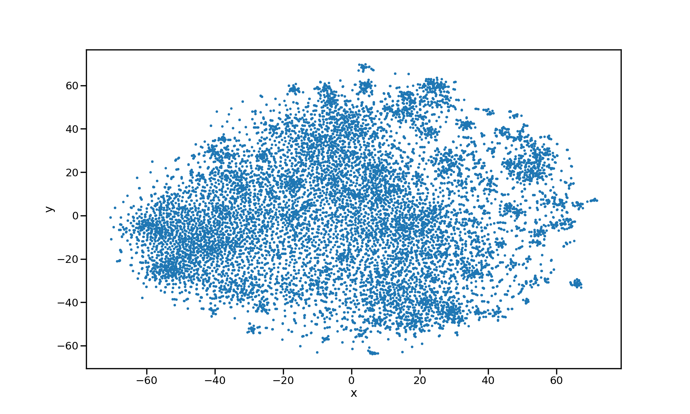
**Zoomed-In Dataset**
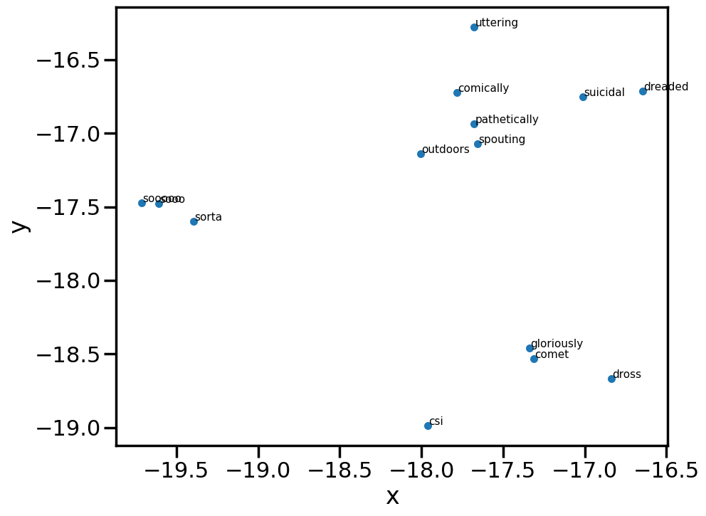
2. Model with Minimum Word Count Threshold as 20 words, and Context Size as 50 records
**Overall Dataset**
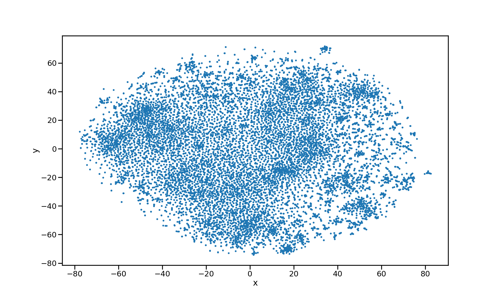
**Zoomed-In Dataset**
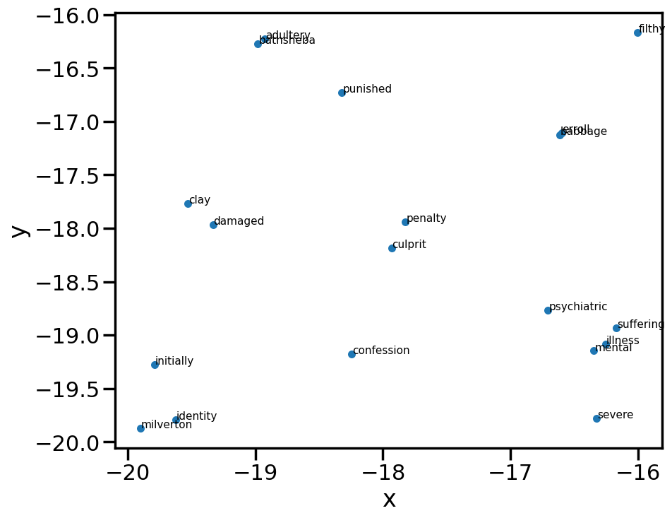
3. Model with Minimum Word Count Threshold as 40 words, and Context Size as 10 records
**Overall Dataset**
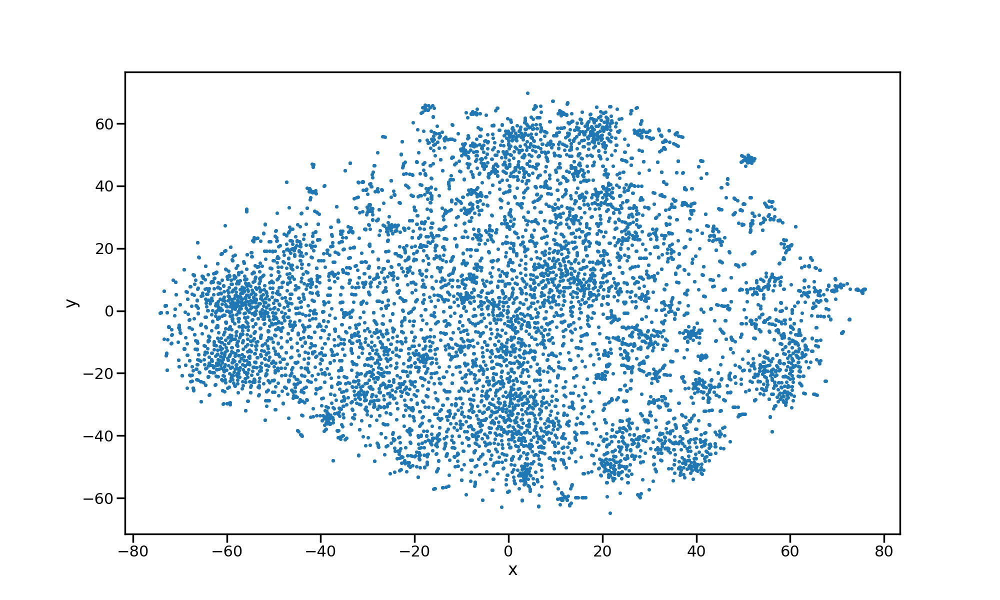
**Zoomed-In Dataset**
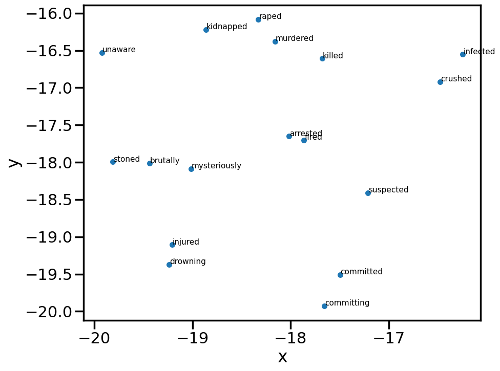
4. Model with Minimum Word Count Threshold as 40 words, and Context Size as 50 records
**Overall Dataset**
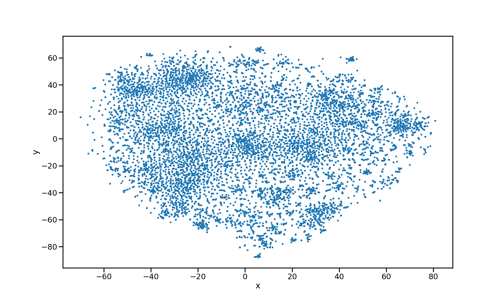
**Zoomed-In Dataset**


### Top 10 Similar Results from the Models
For all the models, I will find similar words for the following 5 words -
1. man
2. awful
3. embarrased
4. happy
5. action

Here are the results (with the similarity score) -
1. **Model with Minimum Word Count Threshold as 20 words, and Context Size as 10 records**
- **Words similar to "man"**
  - woman: 0.6269
  - boy: 0.6094
  - doctor: 0.5976
  - soldier: 0.5814
  - lady: 0.5709
  - person: 0.5685
  - scientist: 0.5589
  - guy: 0.5422
  - journalist: 0.5410
  - cop: 0.5390
- **Words similar to "awful"**
  - terrible: 0.8230
  - horrible: 0.8029
  - dreadful: 0.7437
  - laughable: 0.6999
  - atrocious: 0.6990
  - horrendous: 0.6948
  - lame: 0.6779
  - pathetic: 0.6740
  - abysmal: 0.6733
  - ridiculous: 0.6660
- **Words similar to "embarrased"**
  - pleased: 0.6396
  - ashamed: 0.6032
  - shocked: 0.6024
  - sorry: 0.5790
  - delighted: 0.5773
  - disgusted: 0.5657
  - thrilled: 0.5652
  - amused: 0.5594
  - warned: 0.5373
  - surprised: 0.5371
- **Words similar to "happy"**
  - afraid: 0.4945
  - prepared: 0.4944
  - ready: 0.4899
  - satisfied: 0.4846
  - lucky: 0.4693
  - disappointed: 0.4605
  - wanting: 0.4384
  - pleased: 0.4328
  - sweet: 0.4303
  - sad: 0.4237
- **Words similar to "action"**
  - suspense: 0.5820
  - packed: 0.5540
  - adventure: 0.5424
  - thrills: 0.5341
  - exciting: 0.5168
  - explosions: 0.5074
  - arts: 0.5054
  - kung: 0.4994
  - paced: 0.4950
  - fu: 0.4936
2. **Model with Minimum Word Count Threshold as 20 words, and Context Size as 50 records**
- **Words similar to "man"**
  - doctor: 0.5464
  - woman: 0.5290
  - lad: 0.5078
  - boy: 0.4954
  - businessman: 0.4821
  - psychiatrist: 0.4554
  - lunatic: 0.4476
  - politician: 0.4466
  - himself: 0.4459
  - bloke: 0.4396
- **Words similar to "awful"**
  - terrible: 0.8290
  - horrible: 0.8122
  - atrocious: 0.7181
  - dreadful: 0.7115
  - horrendous: 0.7021
  - lame: 0.6930
  - crappy: 0.6930
  - laughable: 0.6782
  - pathetic: 0.6714
  - stupid: 0.6653
- **Words similar to "embarrased"**
  - sorry: 0.5992
  - shocked: 0.5912
  - inclined: 0.5506
  - ashamed: 0.5120
  - delighted: 0.5083
  - prepared: 0.5083
  - pleased: 0.5034
  - excited: 0.4978
  - pretending: 0.4942
  - tempted: 0.4892
- **Words similar to "happy"**
  - wanting: 0.4714
  - afraid: 0.4467
  - gonna: 0.4433
  - lucky: 0.4366
  - ready: 0.4364
  - satisfied: 0.4226
  - sad: 0.4215
  - cute: 0.4101
  - happily: 0.4008
  - tears: 0.3888
- **Words similar to "action"**
  - fight: 0.6027
  - kung: 0.5969
  - martial: 0.5894
  - arts: 0.5796
  - jackie: 0.5634
  - explosions: 0.5619
  - packed: 0.5523
  - fu: 0.5481
  - stunts: 0.5477
  - cliffhanger: 0.5443
3. **Model with Minimum Word Count Threshold as 40 words, and Context Size as 10 records**
- **Words similar to "man"**
  - woman: 0.6563
  - boy: 0.5997
  - doctor: 0.5930
  - soldier: 0.5875
  - lady: 0.5788
  - scientist: 0.5662
  - monk: 0.5632
  - businessman: 0.5609
  - cop: 0.5435
  - murderer: 0.5399
- **Words similar to "awful"**
  - horrible: 0.7889
  - terrible: 0.7797
  - dreadful: 0.7259
  - atrocious: 0.7116
  - pathetic: 0.6635
  - laughable: 0.6541
  - lame: 0.6536
  - horrendous: 0.6522
  - bad: 0.6462
  - appalling: 0.6449
- **Words similar to "embarrased"**
  - shocked: 0.6344
  - delighted: 0.5827
  - sorry: 0.5756
  - pleased: 0.5696
  - ashamed: 0.5622
  - tempted: 0.5518
  - fascinated: 0.5466
  - prepared: 0.5434
  - disgusted: 0.5346
  - compelled: 0.5311
- **Words similar to "happy"**
  - afraid: 0.5111
  - satisfied: 0.4855
  - disappointed: 0.4504
  - ready: 0.4470
  - lucky: 0.4448
  - pleased: 0.4263
  - wanting: 0.4231
  - excited: 0.4189
  - safe: 0.4178
  - sad: 0.4156
- **Words similar to "action"**
  - suspense: 0.5750
  - thrills: 0.5437
  - adventure: 0.5337
  - paced: 0.5210
  - explosions: 0.5156
  - exciting: 0.5121
  - packed: 0.4957
  - arts: 0.4773
  - gore: 0.4733
  - slasher: 0.4682
4. **Model with Minimum Word Count Threshold as 40 words, and Context Size as 50 records**
- **Words similar to "man"**
  - doctor: 0.5464
  - woman: 0.5290
  - lad: 0.5078
  - boy: 0.4954
  - businessman: 0.4821
  - psychiatrist: 0.4554
  - lunatic: 0.4476
  - politician: 0.4466
  - himself: 0.4459
  - bloke: 0.4396
- **Words similar to "awful"**
  - terrible: 0.8290
  - horrible: 0.8122
  - atrocious: 0.7181
  - dreadful: 0.7115
  - horrendous: 0.7021
  - lame: 0.6930
  - crappy: 0.6930
  - laughable: 0.6782
  - pathetic: 0.6714
  - stupid: 0.6653
- **Words similar to "embarrased"**
  - sorry: 0.5992
  - shocked: 0.5912
  - inclined: 0.5506
  - ashamed: 0.5120
  - delighted: 0.5083
  - prepared: 0.5083
  - pleased: 0.5034
  - excited: 0.4978
  - pretending: 0.4942
  - tempted: 0.4892
- **Words similar to "happy"**
  - wanting: 0.4714
  - afraid: 0.4467
  - gonna: 0.4433
  - lucky: 0.4366
  - ready: 0.4364
  - satisfied: 0.4226
  - sad: 0.4215
  - cute: 0.4101
  - happily: 0.4008
  - tears: 0.3888
- **Words similar to "action"**
  - fight: 0.6027
  - kung: 0.5969
  - martial: 0.5894
  - arts: 0.5796
  - jackie: 0.5634
  - explosions: 0.5619
  - packed: 0.5523
  - fu: 0.5481
  - stunts: 0.5477
  - cliffhanger: 0.5443

As you can see from the above results, the context size and minimum word count threshold affect the scores of similarity of words. For example, 
1. If you observe the similar word to `action`, `fight` is most similar word for both models who are using 50 records as their context size.
2. On the other hand, `suspense` is the most similar word for both models who are using 10 records as their context size.
3. Depending on the above two results, we can say that increasing context size makes a better prediction of the similar words.
4. As imagined the minimum word count threshold does not affect the overall results, rather it only affects the word-bank that results come from, i.e., the dictionary of words or the amount of similar words that the model can extract for a given word.

## Code
All the code is in the [Jupyter notbook](sentiment-analysis-using-word2vec.ipynb) in the folder - [sentiment-analysis-using-word2vec.ipynb](sentiment-analysis-using-word2vec.ipynb)

## References
1. https://www.kaggle.com/datasets/varun08/imdb-dataset
2. https://www.kaggle.com/code/aayushkubba/gensim-word2vec-tutorial#Exploring-the-model
3. https://github.com/MiguelSteph/word2vec-with-gensim/blob/master/word2vec_model_visualization.ipynb
4. https://www.kaggle.com/code/jeevats/sentiment-analysis-using-word2vec/notebook
5. https://www.kaggle.com/code/jihyeseo/word2vec-gensim-play-look-for-similar-words/notebook
6. https://paperswithcode.com/dataset/sst
7. https://www.kaggle.com/code/jihyeseo/word2vec-gensim-play-look-for-similar-words
8. https://github.com/RaRe-Technologies/gensim/wiki/Migrating-from-Gensim-3.x-to-4
9. https://radimrehurek.com/gensim/auto_examples/tutorials/run_word2vec.html
10. https://radimrehurek.com/gensim/models/keyedvectors.html
11. https://radimrehurek.com/gensim/models/word2vec.html#usage-examples